# PixelForge — движок процедурной пиксельной графики

Вся 2D-графика игры описывается **кодом**: юниты со скелетной анимацией
(idle, ходьба, атака, каст, урон, смерть, растворение), существа, бесшовные
тайлы, иконки предметов, UI и визуальные эффекты. На выходе — спрайт-листы
PNG + JSON-метаданные, которые читает любой движок (Godot, Unity, Phaser,
pygame…), и GIF-превью.

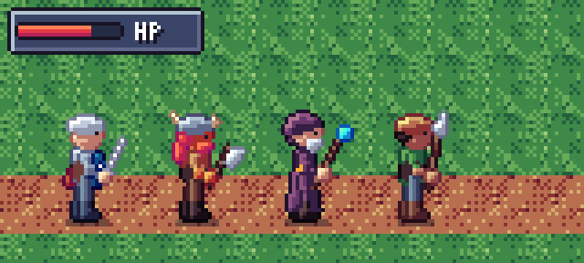

| Рыцарь | Маг | Волк | Взрыв |
|---|---|---|---|
| 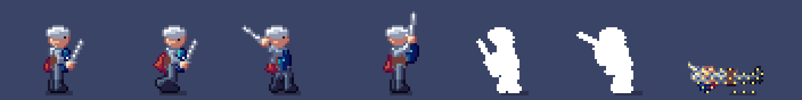 | 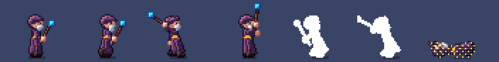 | 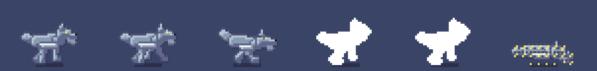 |  |

Правила стиля (hue shifting, selective outline, свет сверху-слева, дизеринг,
тайминги анимаций) собраны из референсов и описаны в
[docs/PIXEL_ART_GUIDE.md](docs/PIXEL_ART_GUIDE.md).

## Автобитва (демо-игра)

**Без Python:** скачайте `AutoBattle.exe` со страницы
[Releases](https://github.com/katiol123/2Dcodom/releases/latest) и запустите двойным щелчком.
Exe собирает GitHub Actions (`.github/workflows/build-exe.yml`) при каждом изменении кода;
локально можно собрать так: `pip install pyinstaller && python tools/make_icon.py &&
pyinstaller --onefile --windowed --name AutoBattle --icon build/icon.ico battle.py`.

Из исходников:

```bash
pip install -r requirements.txt
python battle.py                    # выбор знамени -> карта мира -> «Быстрый бой» -> сбор отрядов -> бой
python battle.py --record b.mp4     # записать бой в видео без окна
python -m game.balance 2000 random  # баланс классов на случайных составах
python -m game.cardsim 64 40        # баланс карт: 64 кампании по 40 ходов
```

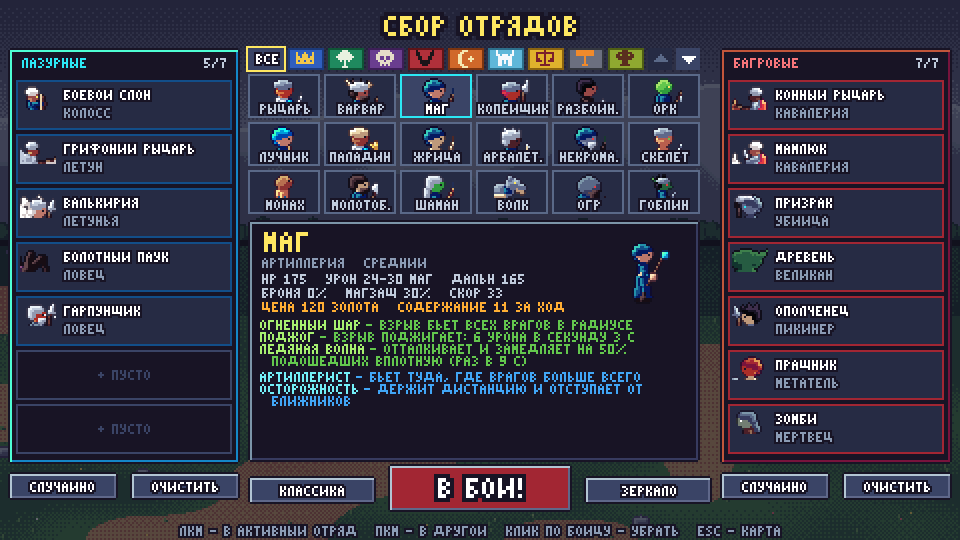

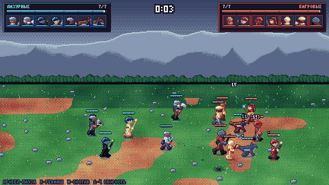

Игра начинается с **выбора знамени**: одна из 8 держав или режим зрителя.
Затем открывается **карта мира**. Она нарисована кодом, в несколько раз
больше экрана, перетаскивается мышью, а колесом отдаляется. На ней
47 городов, соединённых дорогами, 8 играбельных человеческих фракций и
неигровые гоблины. У каждой фракции 12-22 именных офицера с лидерством и
шестью навыками; лица офицеров нарисованы кодом гладкими кривыми и
кликабельны (карточка с биографией и «паутинкой» навыков). В своих городах
кнопки «Армия» и «Наём»: нанять воинов и распределить их по отрядам
офицеров. Подробно — в [docs/CAMPAIGN.md](docs/CAMPAIGN.md).

Всё, что держава делает на карте, — **карты действий** за очки действий (5 ОД за ход): налоги,
походы, штурмы, найм, дипломатия и интриги. Колоду собирает совет: карта фракции от лидера, личные
карты советников и карты за высокие навыки совета. Соперники подбрасывают в колоду проклятия.
Остальные державы играет ИИ. Подробно — в [docs/CARDS.md](docs/CARDS.md).

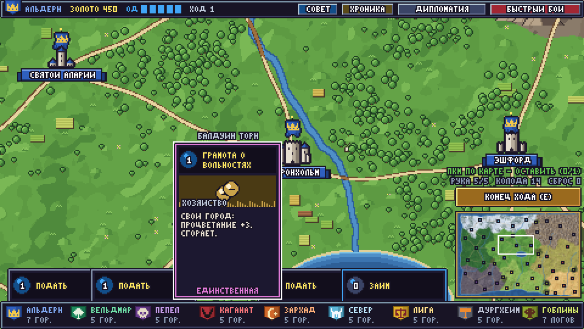

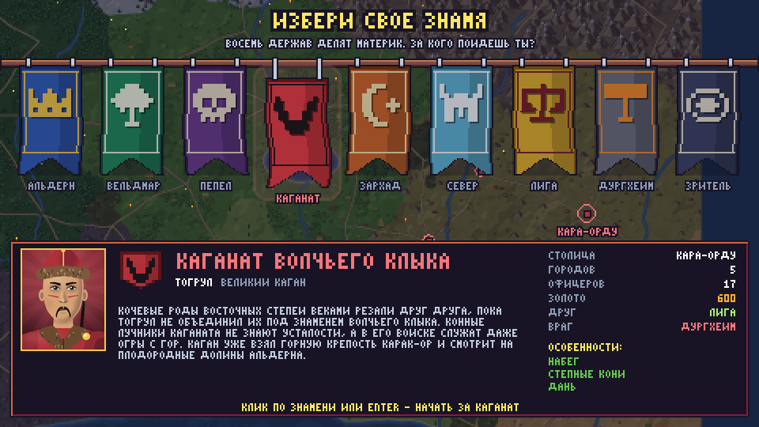

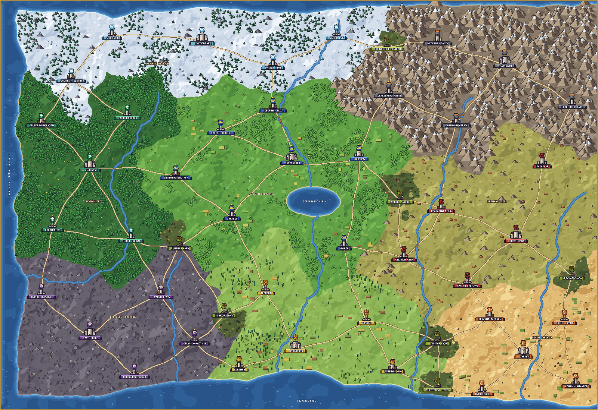

Кнопка «Быстрый бой» открывает экран сбора, где каждая сторона выбирает до 7 бойцов из 56
классов (с фильтром по фракциям): от рыцарей, магов и гоблинов до грифоньих рыцарей, боевых
слонов, валькирий, призраков, железных големов и дешёвого ополчения. Есть и босс — тролль-мусорщик.
- У каждого класса задуманная сила (слабый / ниже среднего / средний / выше среднего), а
  цена найма и содержание выведены из его силы в 2000 тестовых боёв.
- У каждого класса свои характеристики, способности, сильные и слабые
  стороны и модель поведения ИИ.
- У каждого бойца в каждом бою своё лицо: внешность варьируется в
  пределах класса.

Подробно — в [docs/BATTLE.md](docs/BATTLE.md).

## Быстрый старт

```bash
pip install Pillow                   # движку нужен только Pillow (для PNG/GIF)
python -m pixelforge build out       # все пресеты -> out/sprites, out/gif, out/preview
python -m pixelforge unit orc out    # один юнит
python -m pixelforge unit random:42  # случайный (детерминированно по seed)
python -m unittest discover -s tests
```

## Новый юнит — это данные

```python
from pixelforge.units.humanoid import HumanoidSpec, build_humanoid
from pixelforge.export import save_sheet, save_sprite_gif

paladin = HumanoidSpec(
    name="paladin", top="#ead4aa", top_shiny=True, bottom="#8b9bb4",
    helmet="#feae34", helmet_style="crown", cape="#ffffff",
    weapon="axe", weapon_color="#fee761", shield="#feae34", build="stocky",
)
sprite = build_humanoid(paladin)              # idle walk attack cast hurt death vanish
save_sheet(sprite, "out/sprites/paladin.png")  # + paladin.json
save_sprite_gif(sprite, "out/gif/paladin.gif")
left = sprite.flipped("_left")                 # зеркальная версия
red_team = sprite.map(lambda c: c.replace({"#ead4aa": "#e43b44"}))  # палитровый своп
```

Параметры `HumanoidSpec`: цвета кожи/волос/одежды/обуви, причёски
(`short|long|spiky|none`), борода, шлем (`cap|horned|hood|crown`), плащ,
роба, оружие (`sword|axe|spear|staff|dagger|bow|crossbow|mace|hammer|None`), щит, телосложение
(`normal|stocky|slim`), размер (`size=32` → кадр 48×40, оружию и смазам
есть куда вылетать). Готовые пресеты: `knight barbarian mage spearman rogue orc archer king`.

Существа: `build_slime(SlimeSpec(...))`, `build_quadruped(QuadSpec(...))`
(пресеты `WOLF`, `BOAR`, `FOX`).

## Своё существо или анимация — скелет

```python
from pixelforge import Rig, Pose, Material, Limb, Blob, Pixels, from_poses
from pixelforge.shading import BASE

skin = Material.of("skin", "#63c74d")                 # 5-ступенчатая рампа с hue shift
eye = Material.of("eye", "#e43b44", flat=True)

rig = Rig(32, 32, origin=(16, 20))
rig.bone("root", None)
rig.bone("body", "root", 6, world=-90, material=skin, z=10, shapes=[Limb(width=7)])
rig.bone("head", "body", 0, material=skin, z=11, shapes=[
    Blob(rx=4, ry=3.5, t=1, offset=(1, -3)),
    Pixels(material=eye, level=BASE, outline=False, points=[(3, -3.5)]),
])
for side, z, depth in (("b", 5, -1), ("f", 12, 0)):          # дальняя нога темнее
    rig.bone(f"leg_{side}", "root", 7, world=90, z=z, depth=depth, material=skin,
             ground=True, shapes=[Limb(width=3)])

def pose(t):  # углы в "пространстве тела": 0 = вправо, 90 = вниз, -90 = вверх
    return Pose(body={"leg_f": 90 - 25 * t, "leg_b": 90 + 25 * t}, ground=29, duration=120)

walk = from_poses(rig, "walk", [pose(t) for t in (1, 0, -1, 0)])
```

Что делает движок за вас: растеризует формы pixel-perfect, затеняет каждую
группу костей по направлению света, затемняет дальние части, рисует
окклюзионные контуры и selective outline, ставит ноги на землю
(`Pose.ground`), интерполирует позы (`rig.lerp`, `tween`), навешивает
эффекты (`Pose.fx` — смазы/искры, `Pose.post` — вспышка, растворение).

## Остальная графика

```python
from pixelforge.assets import tiles, items, ui, vfx
tiles.grass(seed=3); tiles.cobblestone(); tiles.water()      # бесшовные 16×16, вода анимирована
items.sword(); items.potion("#0099db"); items.coin()          # иконки 16×16, монета крутится
ui.panel(64, 32); ui.button("ИГРА"); ui.bar(40, 0.7)          # шрифт 3×5 с кириллицей
vfx.explosion(); vfx.hit_spark(); vfx.fireball(); vfx.heal()
```

Низкий уровень: `Canvas`/`Grid` (линии, эллипсы, капсулы, полигоны, заливка,
ASCII-штампы), `PartBuffer` + `Shader` (рисуете формы — получаете
затенённый спрайт), `fx` (дизеринг, шум, вспышки, тени), палитры и
квантизация.

## Формат JSON

```json
{"image": "knight.png", "frame_width": 48, "frame_height": 40, "anchor": [23, 37],
 "animations": {"attack": {"row": 2, "loop": false,
   "frames": [{"x": 0, "y": 80, "w": 48, "h": 40, "duration": 240, "events": []},
              {"x": 96, "y": 80, "w": 48, "h": 40, "duration": 220, "events": ["hit"]}]}}}
```

`anchor` — точка между стоп (pivot для позиционирования). `events`:
`hit` (момент нанесения урона), `cast`, `dead`.

## Структура

```
pixelforge/
  color.py palette.py      цвета, рампы с hue shift, палитры
  canvas.py                сетки и pixel-perfect примитивы
  shading.py               материалы, свет, selout-контур
  rig.py                   скелет, позы, растеризация
  anim.py fx.py            анимации/тайминги, дизеринг, эффекты, шум
  export.py text.py        PNG+JSON, GIF, превью; пиксельный шрифт
  units/humanoid.py        гуманоиды + полный набор анимаций
  units/creatures.py       слизень, четвероногие
  assets/                  tiles, items, ui, vfx
battle.py                  демо-игра «Автобитва» (pygame)
game/                      юниты, симуляция боя, ИИ, рендер, звук
tests/                     unittest
docs/                      конспект референсов, превью
```

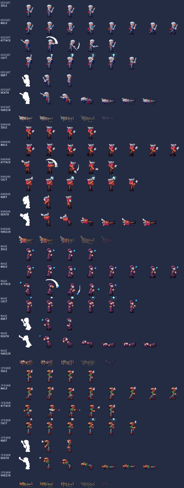
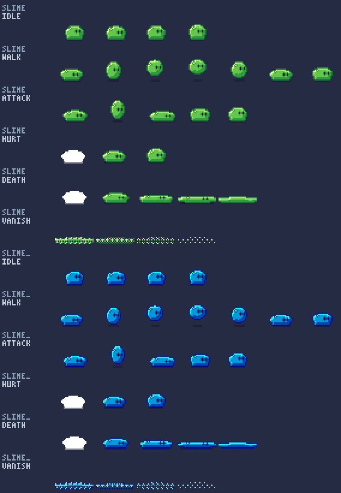
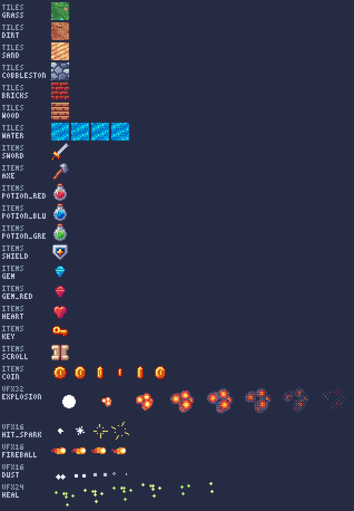
