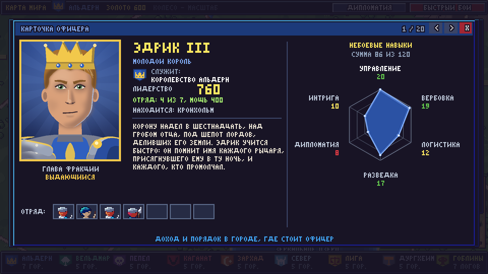
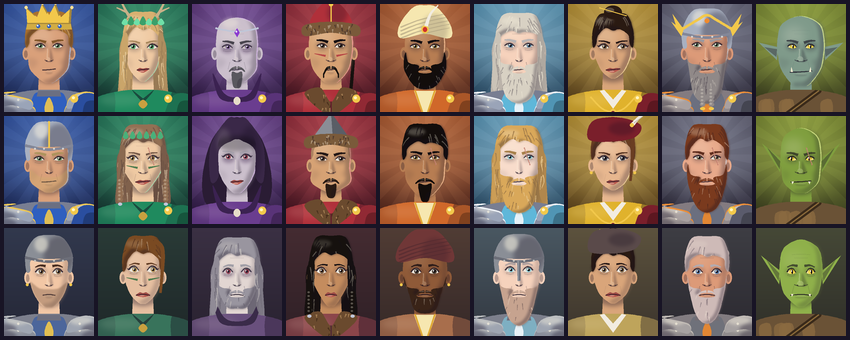

# Глобальная карта: фракции, города, дипломатия

`python battle.py` начинается с **выбора знамени**: девять знамён висят
на балке над тёмной картой мира — восемь держав и Летописец (режим
зрителя). Наведи на знамя: оно опускается и светится, карта за ним
поворачивается к столице этой державы, а её города загораются. Панель
внизу показывает герб, лидера (рисованный портрет, клик — карточка),
предысторию, столицу, число городов и офицеров, стартовое золото, лучшего
друга и худшего врага. Клик (или ENTER) — знамя выбрано, остальные
взлетают, экран вспыхивает и открывается карта.


Затем открывается **карта мира**. Она нарисована кодом
(`game/worldgen.py`) и в несколько раз больше экрана: 1600×1100 пикселей
при экране 480×270.

**Управление**
- Карта перетаскивается левой кнопкой мыши. Ещё можно стрелками или WASD,
  или кликнуть по миникарте.
- Колесо мыши отдаляет карту (×½ и ×¼, вся карта целиком). Ближе 1:1
  приблизить нельзя. При отдалении города становятся флажками и гербами.
- Клик по городу открывает панель города: владелец, офицеры (лица
  кликабельны), свободные воины, наём, дороги.
- У городов своей фракции слева от панели появляются кнопки **АРМИЯ** и
  **НАЙМ** (у чужих городов и в режиме зрителя их нет).
- Клик по фракции на нижней панели открывает её герб, лидера,
  предысторию, особенности и отношения.
- «Дипломатия» — таблица отношений всех фракций, у каждой клетки есть
  обоснование.
- «Быстрый бой» — экран сбора отрядов, с него запускается бой.
- ПКМ или ESC закрывает панель. ESC на пустой карте выходит из игры.

Ход, доход, походы, штурмы, дипломатия и интриги идут через **карты действий** —
см. [CARDS.md](CARDS.md). У каждого города есть процветание (1..10), от него зависит
налог. Штурм пока решается по силе отрядов; запуск автобоя для штурма — следующий шаг.


## Как устроена карта

- **Регионы.** Каждая точка земли принадлежит культуре ближайшего города
  (границы искажены шумом). Поэтому у каждой фракции своя земля: снег и
  ели Севера, горы Дургхейма, равнины и поля Альдерна, Вечный лес
  Вельдмара, серые пустоши Пепла, степь Каганата, пески Зархада,
  побережье Лиги. Вокруг гоблинских логовищ — пятна топи с хламом.
- **Рельеф.** Свет падает сверху слева. Тени и блики квантуются в 3–4
  тона, градиентов нет.
- **Детали.** Деревья, горы, дюны, пальмы, могилы, камыши, мельницы,
  поля — маленькие спрайты с тёмным контуром. Они рисуются сверху вниз,
  поэтому ближние перекрывают дальние.
- **Вода.** Береговая линия, озеро и реки заданы контрольными точками.
  Цвет воды зависит от расстояния до берега. Где дорога пересекает
  реку, стоит мост.
- **Города.** Шесть видов: столица, крепость, форт, город, порт и
  логово. Над каждым — развевающийся флаг с гербом фракции, под ним —
  лента с названием в её цвете. У столиц на ленте корона.
- **Кэш.** Готовая карта сохраняется в PNG. Пока не изменится её
  дизайн, при следующих запусках она грузится мгновенно.

## Фракции

Восемь играбельных фракций — человеческие государства. Гоблины —
**неигровая** фракция: с ними нельзя вести дипломатию, только воевать.
Их логова разбросаны по всей карте, и любая фракция может их отбить.

Особенности фракций — предложения для будущего пошагового режима. Пока
они не действуют.

### Королевство Альдерн

- **Лидер:** Эдрик III, молодой король
- **Герб:** золотая корона на синем
- **Столица:** Кронхольм; городов: 7

Старейшее королевство людей на равнинах у Зеркального озера. Рыцари Альдерна веками стерегли тракты, но после гибели старого короля знать грызётся за власть, и юный Эдрик III держит корону лишь верностью паладинов. С востока давит Каганат, с юго-запада ползёт Пепел - бывшее герцогство самого Альдерна.

Особенности:
- **Королевские тракты** — по дорогам между своими городами отряды идут на 1 город дальше
- **Рыцарская честь** — рыцари и паладины +15% HP, защищая свои города
- **Налоги** — +20% золота с городов, но после поражений растёт недовольство

### Лесное княжество Вельдмар

- **Лидер:** Аэлина, княгиня-друид
- **Герб:** серебряное древо на зелёном
- **Столица:** Сильваэн; городов: 5

Потомки первых поселенцев, ушедших в Вечный лес и заключивших договор с его духами. Егеря Вельдмара бьют белку в глаз, а друиды говорят с деревьями. Корона Альдерна считает их мятежными вассалами, но в чащу за ними не суётся. С юга наступает мёртвая земля, и корни Древа-Матери чернеют.

Особенности:
- **Лесные тропы** — между своими лесными городами можно ходить без дорог
- **Меткость егерей** — лучники и егеря получают +15% дальности
- **Целительная чаща** — в лесных городах раненые отряды лечатся вдвое быстрее

### Пепельное герцогство

- **Лидер:** Велгарот, герцог-некромант
- **Герб:** костяной череп на пурпурном
- **Столица:** Мор-Кхаар; городов: 5

Чума выкосила богатейшее герцогство Альдерна за одно лето. Выжившие отреклись от короны и пошли за придворным магом Велгаротом, который поднял их мёртвых родных на защиту границ. Здесь живые пашут землю бок о бок с мертвецами, а соседи видят в них чудовищ.

Особенности:
- **Жатва** — после любой битвы рядом часть павших встаёт скелетами в гарнизон
- **Мёртвые не просят жалованья** — нежить не требует золота на содержание, только ману
- **Чумной туман** — соседние вражеские города теряют 10% дохода

### Каганат Волчьего Клыка

- **Лидер:** Тогрул, великий каган
- **Герб:** чёрные клыки на красном
- **Столица:** Кара-Орду; городов: 5

Кочевые роды восточных степей веками резали друг друга, пока Тогрул не объединил их под знаменем Волчьего Клыка. Конные лучники Каганата не знают усталости, а в его войске служат даже огры с гор. Каган уже взял горную крепость Карак-Ор и смотрит на плодородные долины Альдерна.

Особенности:
- **Набег** — город можно разграбить ради золота, не захватывая его
- **Степные кони** — в степи отряды Каганата ходят на 1 город дальше
- **Дань** — соседи с отношением ниже 30 платят Каганату за мир

### Султанат Зархад

- **Лидер:** Саладир, султан песков
- **Герб:** песочный полумесяц со звездой на оранжевом
- **Столица:** Зархад; городов: 5

За Гнилой топью лежат пески и оазисы Зархада. Султан Саладир правит из сада-дворца над подземной рекой, его мамлюки и боевые слоны славятся на всё побережье, а маги огня учатся у самого солнца. Султанат сказочно богат, но отрезан от мира болотами, кишащими гоблинами.

Особенности:
- **Оазисы** — в пустынных городах отряды восстанавливаются вдвое быстрее
- **Караваны** — +5% золота за каждую фракцию, с которой нет войны
- **Зной** — чужие отряды в пустыне теряют 5% HP каждый ход

### Ярлства Севера

- **Лидер:** Хальвдан, ярл Седая Грива
- **Герб:** рогатый шлем на ледяном
- **Столица:** Хьёльдгард; городов: 5

За снежными перевалами живут ярлы - мореходы, охотники и сказители. С каждым годом зимы всё длиннее, и драккары всё чаще уходят на юг за зерном. Старый Хальвдан хочет мира и торговли, но молодые хускарлы жаждут саг о великих набегах.

Особенности:
- **Зимний поход** — зимой отряды Севера не слабеют, а враги идут медленнее
- **Саги** — бойцы, убившие многих врагов, быстрее растут в уровне
- **Драккары** — из портов Севера можно напасть на любой прибрежный город

### Золотая Лига

- **Лидер:** Октавия Вальмарри, дож Лиги
- **Герб:** гранатовые весы на золотом
- **Столица:** Вальмарра; городов: 5

Портовые города юга сто лет назад выкупили свободу у короны Альдерна - золотом, а не кровью. С тех пор Лигой правят торговые дома, а воюют за неё наёмники. Дож Октавия продаёт оружие всем сторонам и следит, чтобы ни одна из них не стала слишком сильной.

Особенности:
- **Наёмники** — отряд из пула соседнего чужого города можно нанять за двойную цену
- **Торговые договоры** — +10% золота за каждую фракцию с отношением выше 60
- **Подкуп** — за золото можно переманить вражеский гарнизон

### Горное королевство Дургхейм

- **Лидер:** Бруни Железнобород, тан горцев
- **Герб:** оранжевый молот на стальном
- **Столица:** Дургхейм; городов: 5

Горцы северо-востока живут в крепостях, высеченных в скалах, и куют лучшую сталь мира. Их тан ничего не забывает: падение Карак-Ора записано в Книге Обид кровью. Снизу шахты подтачивают гоблины, с юга давит Каганат, но горы стоят три тысячи лет - и простоят ещё столько же.

Особенности:
- **Каменные стены** — гарнизоны горных городов получают +20% брони
- **Шахты** — горные города дают двойной доход
- **Книга обид** — +10% урона против фракции, напавшей на горцев первой

### Гоблинские племена (неигровая)

- **Главарь:** Бугор, тролль-мусорщик
- **Герб:** бурый гриб на кислотно-зелёном
- **Логово босса:** Гнилая Куча; логов: 7

Дикие племена гоблинов засели в топях, руинах и пещерах по всему материку. Они грабят всех подряд, тащат в норы любой хлам и плодятся быстрее, чем их успевают выбивать. Договориться с ними невозможно - их города можно только отбить.

Особенности:
- **Не ведут переговоров** — вечная война со всеми, дипломатия невозможна
- **Плодятся** — каждый ход в гоблинских городах прибавляется трусливый гоблин
- **Набеги** — разросшиеся гарнизоны нападают на ближайший слабый город
- **Логово тролля** — Гнилую Кучу охраняет босс - тролль Бугор

## Отношения

Шкала 1–100: около 50 — нейтралитет, выше 80 — союз или близко к нему, ниже 20 — война или близко к ней. С гоблинами всегда война (X).

| | Альдерн | Вельдмар | Пепел | Каганат | Зархад | Север | Лига | Дургхейм |
|---|---|---|---|---|---|---|---|---|
| Альдерн | — | 42 | 8 | 18 | 58 | 40 | 60 | 84 |
| Вельдмар | 42 | — | 5 | 35 | 50 | 66 | 44 | 36 |
| Пепел | 8 | 5 | — | 38 | 26 | 14 | 45 | 20 |
| Каганат | 18 | 35 | 38 | — | 24 | 48 | 52 | 6 |
| Зархад | 58 | 50 | 26 | 24 | — | 50 | 28 | 64 |
| Север | 40 | 66 | 14 | 48 | 50 | — | 56 | 66 |
| Лига | 60 | 44 | 45 | 52 | 28 | 56 | — | 81 |
| Дургхейм | 84 | 36 | 20 | 6 | 64 | 66 | 81 | — |

- **Альдерн — Вельдмар: 42** (нейтралитет). Вельдмар когда-то был вассалом короны. Альдерн требует налогов, лес молчит и не платит.
- **Альдерн — Пепел: 8** (война). Пепельное герцогство - мятежная земля Альдерна. Корона не признаёт Велгарота, война идёт десятилетиями.
- **Альдерн — Каганат: 18** (война). Конница Каганата жжёт восточные деревни, Альдерн держит против неё форты. Большая война вот-вот начнётся.
- **Альдерн — Зархад: 58** (нейтралитет). Далёкий, но щедрый партнёр: пряности и шёлк в обмен на зерно с полей Хартвела.
- **Альдерн — Север: 40** (напряжение). Северяне грабят северные пашни, но и торгуют мехами. Ярл ищет мира, его хускарлы - нет.
- **Альдерн — Лига: 60** (дружба). Лига - бывшие вассалы короны. Торгуют охотно, но вечно спорят о пошлинах и старых долгах.
- **Альдерн — Дургхейм: 84** (союз). Древний союз: горцы куют рыцарям доспехи, король платит серебром и помогает против Каганата.
- **Вельдмар — Пепел: 5** (война). Мёртвая земля отравляет корни Вечного леса. Для Вельдмара это священная война.
- **Вельдмар — Каганат: 35** (напряжение). Кочевники выжигают восточные рощи под пастбища. Лес помнит каждое сожжённое дерево.
- **Вельдмар — Зархад: 50** (нейтралитет). Почти не встречались. Купцы султана скупают редкие лесные травы, и только.
- **Вельдмар — Север: 66** (дружба). Северяне, как и лесной народ, чтут духов зверей. Охотничье братство и торговля мехами.
- **Вельдмар — Лига: 44** (нейтралитет). Лига скупает лесную древесину у контрабандистов. Выгодно, но Вельдмар недоволен.
- **Вельдмар — Дургхейм: 36** (напряжение). Старая обида: горцы срубили священные дубы для крепей своих шахт и не извинились.
- **Пепел — Каганат: 38** (напряжение). Шаманы Каганата боятся мёртвых, но у обоих один враг - Альдерн. Настороженное молчание.
- **Пепел — Зархад: 26** (напряжение). Жрецы солнца прокляли Велгарота. Торговля запрещена, но войны пока нет - их разделяет море.
- **Пепел — Север: 14** (война). Ярлы сжигают своих мёртвых, чтобы те не встали. Некромантия для них худшее из зол.
- **Пепел — Лига: 45** (нейтралитет). Купцы Лиги тайно покупают у Пепла редкие реагенты, поэтому худой мир.
- **Пепел — Дургхейм: 20** (напряжение). Горцы чтят предков, и поднимать мёртвых для них кощунство. Близки к войне.
- **Каганат — Зархад: 24** (напряжение). Каганат грабит караваны Зархада на степных трактах. Султан платит дань, но копит обиду.
- **Каганат — Север: 48** (нейтралитет). Обе стороны уважают силу, но спорят за пастбища у северных отрогов. Пока нейтралитет.
- **Каганат — Лига: 52** (нейтралитет). Лига продаёт Каганату оружие, Каганат грабит её караваны. Хрупкое равновесие.
- **Каганат — Дургхейм: 6** (война). Каганат взял горную крепость Карак-Ор. Тан Бруни поклялся вернуть её - война идёт сейчас.
- **Зархад — Север: 50** (нейтралитет). Слишком далеко для вражды. Северный янтарь и меха ценятся при дворе султана.
- **Зархад — Лига: 28** (напряжение). Соперники за морскую торговлю. У южного берега идёт война пошлин и каперов.
- **Зархад — Дургхейм: 64** (дружба). Горная сталь в обмен на пряности и золото. Караваны идут в обход степи.
- **Север — Лига: 56** (нейтралитет). Меха и китовый жир идут в порты Лиги. Иногда северяне грабят её склады, и цены растут.
- **Север — Дургхейм: 66** (дружба). Соседи по горам: железо в обмен на меха и общая неприязнь к Каганату.
- **Лига — Дургхейм: 81** (союз). Горная сталь уходит за море через порты Лиги. Торговый союз, выгодный обоим.

## Города и наём

Пул найма привязан к **городу**, а не к фракции: тот, кто владеет городом, нанимает в нём эти отряды. Поэтому захват чужого города даёт доступ к чужим войскам. Например, у Каганата в Карак-Оре остаются горские молотобойцы, а у Альдерна в Западной Заставе — лесные егеря. В каждом городе от 3 до 6 видов отрядов. В скобках — цена найма в золоте (содержание за ход - в docs/BATTLE.md). Дешёвые отряды по 40-55 золота есть у каждой фракции: их нанимают, когда в казне пусто.

**Королевство Альдерн**

| Город | Тип | Наём | Дороги |
|---|---|---|---|
| Кронхольм | столица | Рыцарь (100), Паладин (125), Жрица (115), Копейщик (85), Лучник (80), Грифоний рыцарь (120) | Святой Аларий, Эшфорд, Хартвел, Северный Брод |
| Святой Аларий | город | Монах (90), Жрица (115), Паладин (125), Копейщик (85) | Кронхольм, Северный Брод, Западная Застава |
| Эшфорд | крепость | Рыцарь (100), Копейщик (85), Арбалетчик (105), Конный рыцарь (120), Улан (165) | Серебряная Жила, Кронхольм, Люмен, Ржавая Свалка |
| Хартвел | город | Копейщик (85), Лучник (80), Рыцарь (100), Конный рыцарь (120), Ополченец (45), Боевой пёс (45) | Кронхольм, Западная Застава, Тремонт, Грибная Нора |
| Люмен | город | Маг (120), Жрица (115), Монах (90), Рыцарь (100) | Эшфорд, Аурелия, Степной Стан |
| Северный Брод | форт | Копейщик (85), Лучник (80), Варвар (110), Рыцарь (100), Ополченец (45) | Волчья Падь, Кронхольм, Святой Аларий |
| Западная Застава | форт | Лучник (80), Копейщик (85), Лесной егерь (70), Паладин (125) | Святой Аларий, Хартвел, Сильваэн |

**Лесное княжество Вельдмар**

| Город | Тип | Наём | Дороги |
|---|---|---|---|
| Сильваэн | столица | Лесной егерь (70), Дриада (105), Древень (150), Друид (85), Танцующий с клинками (65), Лучник (80) | Западная Застава, Лунная Поляна, Корни Мира, Тихая Заводь, Серебряный Ручей |
| Лунная Поляна | город | Лучник (80), Лесной егерь (70), Друид (85), Пращник (50) | Снежный Курган, Сильваэн |
| Корни Мира | город | Древень (150), Дриада (105), Друид (85), Волк (80), Боевой пёс (45) | Сильваэн, Тихая Заводь, Курган Королей |
| Тихая Заводь | город | Лучник (80), Лесной егерь (70), Разбойник (105), Танцующий с клинками (65) | Сильваэн, Корни Мира, Чумной Брод, Грибная Нора |
| Серебряный Ручей | форт | Танцующий с клинками (65), Лучник (80), Монах (90) | Снежный Курган, Сильваэн |

**Пепельное герцогство**

| Город | Тип | Наём | Дороги |
|---|---|---|---|
| Мор-Кхаар | столица | Некромант (125), Скелет (90), Рыцарь смерти (130), Призрак (75), Банши (60), Зомби (40) | Чумной Брод, Курган Королей, Пепельная Гавань |
| Чумной Брод | форт | Скелет (90), Гуль (80), Некромант (125), Копейщик (85), Зомби (40) | Тихая Заводь, Мор-Кхаар, Серый Монастырь, Грибная Нора |
| Курган Королей | город | Скелет (90), Рыцарь смерти (130), Призрак (75), Зомби (40) | Корни Мира, Мор-Кхаар |
| Пепельная Гавань | порт | Скелет (90), Гуль (80), Вампир (115), Разбойник (105) | Мор-Кхаар, Серый Монастырь |
| Серый Монастырь | город | Гуль (80), Банши (60), Некромант (125), Вампир (115), Монах (90) | Чумной Брод, Пепельная Гавань, Корвина, Вонючая Топь |

**Каганат Волчьего Клыка**

| Город | Тип | Наём | Дороги |
|---|---|---|---|
| Карак-Ор | крепость | Варвар (110), Огр (150), Молотобоец (100), Арбалетчик (105), Конный лучник (75) | Глубинный Горн, Кара-Орду |
| Кара-Орду | столица | Конный лучник (75), Варвар (110), Волк (80), Шаман (95), Боевой барабанщик (75), Огр (150) | Карак-Ор, Кровавый Брод, Курган Предков, Красная Скала |
| Кровавый Брод | форт | Конный лучник (75), Волк (80), Варвар (110), Пращник (50) | Каменный Страж, Кара-Орду, Степной Стан, Ржавая Свалка |
| Курган Предков | город | Шаман (95), Боевой барабанщик (75), Конный лучник (75), Лучник (80), Боевой пёс (45) | Кара-Орду, Степной Стан, Красные Барханы |
| Степной Стан | город | Конный лучник (75), Волк (80), Копейщик (85), Орк (120), Пращник (50) | Люмен, Кровавый Брод, Курган Предков, Ржавая Свалка |

**Султанат Зархад**

| Город | Тип | Наём | Дороги |
|---|---|---|---|
| Зархад | столица | Мамлюк (125), Боевой слон (145), Огненный дервиш (75), Ассасин (75), Маг (120), Копейщик (85) | Порт Бахри, Оазис Сафир, Красные Барханы, Медный Минарет |
| Порт Бахри | порт | Лучник (80), Ассасин (75), Разбойник (105), Копейщик (85), Пращник (50) | Зархад, Пиратская Отмель |
| Оазис Сафир | город | Монах (90), Жрица (115), Мамлюк (125), Огненный дервиш (75) | Зархад, Медный Минарет, Красная Скала |
| Красные Барханы | форт | Мамлюк (125), Лучник (80), Копейщик (85), Боевой слон (145), Пращник (50) | Курган Предков, Зархад, Гнилая Куча |
| Медный Минарет | город | Маг (120), Огненный дервиш (75), Жрица (115) | Зархад, Оазис Сафир |

**Ярлства Севера**

| Город | Тип | Наём | Дороги |
|---|---|---|---|
| Скальвик | порт | Варвар (110), Лучник (80), Валькирия (100), Ледяная ведьма (80), Гарпунщик (80) | Хьёльдгард, Снежный Курган |
| Хьёльдгард | столица | Варвар (110), Волк (80), Шаман (95), Валькирия (100), Ледяной великан (100), Гарпунщик (80) | Скальвик, Волчья Падь |
| Волчья Падь | город | Волк (80), Варвар (110), Шаман (95), Ледяной великан (100), Боевой пёс (45) | Хьёльдгард, Белый Рог, Северный Брод |
| Снежный Курган | форт | Варвар (110), Шаман (95), Скелет (90) | Скальвик, Лунная Поляна, Серебряный Ручей |
| Белый Рог | город | Варвар (110), Волк (80), Молотобоец (100), Валькирия (100), Боевой пёс (45) | Волчья Падь, Гоблинские Пещеры |

**Золотая Лига**

| Город | Тип | Наём | Дороги |
|---|---|---|---|
| Вальмарра | столица | Арбалетчик (105), Разбойник (105), Алебардщик (85), Дуэлянт (85), Алхимик (70), Маг (120) | Корвина, Аурелия, Тремонт |
| Корвина | порт | Разбойник (105), Арбалетчик (105), Дуэлянт (85), Лучник (80), Пращник (50), Гарпунщик (80) | Серый Монастырь, Вальмарра |
| Аурелия | город | Алебардщик (85), Арбалетчик (105), Монах (90), Алхимик (70) | Люмен, Вальмарра, Солёный Мыс, Гнилая Куча |
| Солёный Мыс | форт | Алебардщик (85), Лучник (80), Разбойник (105), Ополченец (45) | Аурелия, Гнилая Куча, Пиратская Отмель |
| Тремонт | город | Копейщик (85), Алебардщик (85), Арбалетчик (105), Рыцарь (100), Ополченец (45), Улан (165) | Хартвел, Вальмарра, Вонючая Топь |

**Горное королевство Дургхейм**

| Город | Тип | Наём | Дороги |
|---|---|---|---|
| Дургхейм | столица | Молотобоец (100), Арбалетчик (105), Горный щитоносец (70), Рунный жрец (125), Железный голем (145) | Железная Пасть, Глубинный Горн, Каменный Страж |
| Железная Пасть | крепость | Молотобоец (100), Горный щитоносец (70), Арбалетчик (105) | Дургхейм, Гоблинские Пещеры |
| Глубинный Горн | город | Молотобоец (100), Железный голем (145), Рунный жрец (125), Арбалетчик (105) | Дургхейм, Карак-Ор |
| Каменный Страж | форт | Горный щитоносец (70), Арбалетчик (105), Молотобоец (100), Копейщик (85), Ополченец (45) | Дургхейм, Серебряная Жила, Кровавый Брод |
| Серебряная Жила | город | Молотобоец (100), Арбалетчик (105), Рунный жрец (125), Ополченец (45) | Каменный Страж, Эшфорд, Гоблинские Пещеры |

**Гоблинские племена**

| Город | Тип | Наём | Дороги |
|---|---|---|---|
| Гнилая Куча | логово | Гоблин (55), Безумный гоблин (105), Гоблин-шаман (110), Гоблин-подрывник (40), Тролль-мусорщик (400) | Аурелия, Солёный Мыс, Красные Барханы, Пиратская Отмель |
| Пиратская Отмель | логово | Гоблин (55), Гоблин-подрывник (40), Разбойник (105) | Солёный Мыс, Порт Бахри, Гнилая Куча |
| Грибная Нора | логово | Гоблин (55), Гоблин-шаман (110), Болотный паук (75) | Хартвел, Тихая Заводь, Чумной Брод, Вонючая Топь |
| Ржавая Свалка | логово | Гоблин (55), Безумный гоблин (105), Гоблин-подрывник (40), Огр (150) | Эшфорд, Кровавый Брод, Степной Стан |
| Гоблинские Пещеры | логово | Гоблин (55), Безумный гоблин (105), Гоблин на лютоволке (145) | Белый Рог, Железная Пасть, Серебряная Жила |
| Вонючая Топь | логово | Гоблин (55), Болотный паук (75), Гоблин-шаман (110) | Серый Монастырь, Тремонт, Грибная Нора |
| Красная Скала | логово | Гоблин (55), Гоблин на лютоволке (145), Безумный гоблин (105), Огр (150) | Кара-Орду, Оазис Сафир |


## Офицеры, армия и наём

У каждой фракции от 12 до 22 **именных офицеров** (`game/officers.py`),
первый в списке — её лидер. Офицер сам не сражается: за ним закреплён
один отряд до **7 воинов**.

- **ЛИДЕРСТВО** — максимальная суммарная мощь отряда. Мощь воина равна
  его цене найма, а цена выведена из измеренной силы класса. Лидер ведёт
  760-800, высший чин 480-620, офицеры 330-470, младшие 200-340.
- **Шесть небоевых навыков**, каждый от 1 до 20. Они понадобятся в
  пошаговом режиме:
  - **Управление** — доход и порядок в городе, где стоит офицер;
  - **Вербовка** — скидка на найм и шанс бесплатных новобранцев;
  - **Логистика** — дальность похода и меньшее содержание отряда;
  - **Разведка** — видит силы врага в соседних городах;
  - **Дипломатия** — успех посольств и договоров;
  - **Интрига** — саботаж и подкуп, защита от измены;
- У каждой державы свои сильные и слабые стороны: горцы — управленцы и
  интенданты, Лига — дипломаты и интриганы, Каганат — разведка и
  логистика, гоблины — разведка и вербовка, но не дипломатия.
- Офицер служит фракции, но **может перейти на другую сторону** (измена,
  подкуп, плен): в карточке видно, кому он служит сейчас и откуда родом.

**Карточка офицера.** Лицо или имя офицера кликабельны везде, где он
встречается (окно армии, панель города, окно фракции, выбор знамени).
Карточка показывает портрет, титул, кому служит, лидерство, где стоит,
его отряд, короткую биографию и навыки «паутинкой». Стрелки или колесо —
следующий офицер той же фракции.



**Портреты.** Лица рисуются кодом (`game/faces.py`), но не пикселями, а
гладкими кривыми с мягкими тенями. Игра рисует их после целочисленного
масштабирования кадра, поэтому они чёткие при любом размере окна
(`game/hires.py`). Внешность зависит от **харизмы**: лидерство плюс
среднее навыков. Сильные офицеры поднимают подбородок, смотрят жёстко,
носят металл и плащ с золотой застёжкой, за ними сияние. Заурядные —
мягкие черты, усталые глаза, простая одежда и серый фон. Рамка портрета в
карточке тоже говорит о калибре: золото, серебро или серое железо.



**Армия.** Левая половина окна — офицер города (стрелки < > листают
офицеров), его лидерство, полоска мощи отряда и 7 слотов. Правая — воины,
стоящие в городе без командира. Клик по свободному воину ставит его в
отряд (если хватает лидерства и мест; иначе красная подсказка с
причиной), клик по слоту возвращает воина в город.

**Наём.** Список воинов из пула города с ценой и содержанием. Кнопка
«НАНЯТЬ» активна, если хватает золота. Нанятый воин сразу стоит в этом
городе свободным, в отряд его берёт офицер в окне армии.

На старте каждый офицер стоит в одном из городов своей державы (в каждом
городе есть хотя бы один, лидер — в столице), у каждого отряд примерно на
половину лидерства, а в городах ждут по 1-2 дешёвых новобранца. Стартовая
казна — 600 золота (Лига 900, Зархад 800, гоблины 300).

**Королевство Альдерн** (20)

| Офицер | Титул | Лидерство | Упра. | Верб. | Логи. | Разв. | Дипл. | Интр. |
|---|---|---|---|---|---|---|---|---|
| Эдрик III | молодой король | 760 | 20 | 19 | 12 | 17 | 8 | 10 |
| Гарет Вейл | лорд | 600 | 13 | 18 | 16 | 11 | 14 | 14 |
| Изольда Крон | леди | 490 | 20 | 14 | 14 | 13 | 13 | 4 |
| Брандон Эшфорд | лорд | 540 | 16 | 15 | 11 | 5 | 15 | 12 |
| Освальд Грей | лорд | 530 | 17 | 19 | 10 | 9 | 20 | 11 |
| Матильда Харт | дама-рыцарь | 350 | 17 | 18 | 12 | 12 | 14 | 6 |
| Роланд Пирс | рыцарь | 410 | 14 | 11 | 13 | 9 | 13 | 5 |
| Седрик Блек | рыцарь | 470 | 12 | 16 | 12 | 16 | 11 | 13 |
| Элинор Вест | дама-рыцарь | 440 | 14 | 13 | 11 | 5 | 11 | 6 |
| Тобиас Рид | рыцарь | 440 | 9 | 13 | 12 | 15 | 11 | 6 |
| Гавейн Стоун | рыцарь | 450 | 18 | 16 | 12 | 6 | 9 | 6 |
| Беатрис Лейн | капитан | 280 | 20 | 13 | 8 | 8 | 6 | 5 |
| Улрик Морн | капитан | 330 | 13 | 16 | 12 | 10 | 14 | 6 |
| Персиваль Дейн | капитан | 280 | 15 | 10 | 12 | 12 | 7 | 5 |
| Агнес Флетчер | капитан | 340 | 9 | 12 | 10 | 6 | 12 | 6 |
| Джефри Коул | капитан | 210 | 8 | 16 | 8 | 11 | 8 | 7 |
| Алисия Ворд | капитан | 290 | 16 | 13 | 7 | 11 | 10 | 5 |
| Балдуин Торн | капитан | 230 | 8 | 15 | 8 | 3 | 6 | 1 |
| Хьюго Бейл | капитан | 240 | 12 | 16 | 7 | 8 | 10 | 4 |
| Ровена Лэнс | капитан | 200 | 10 | 12 | 8 | 8 | 9 | 1 |

**Лесное княжество Вельдмар** (14)

| Офицер | Титул | Лидерство | Упра. | Верб. | Логи. | Разв. | Дипл. | Интр. |
|---|---|---|---|---|---|---|---|---|
| Аэлина | княгиня-друид | 800 | 15 | 11 | 15 | 20 | 20 | 14 |
| Элвин Лиственный | старейшина | 560 | 13 | 8 | 12 | 16 | 13 | 8 |
| Риана Тень | старейшина | 530 | 15 | 12 | 15 | 17 | 20 | 15 |
| Талион Вереск | старейшина | 590 | 15 | 9 | 12 | 13 | 14 | 13 |
| Мирель Роса | старейшина | 560 | 7 | 10 | 10 | 16 | 14 | 13 |
| Каэл Осиновый | егерь-капитан | 370 | 9 | 8 | 8 | 14 | 13 | 14 |
| Лиора Лунная | егерь-капитан | 350 | 9 | 8 | 5 | 13 | 19 | 11 |
| Фаэрон Мох | егерь-капитан | 390 | 12 | 9 | 6 | 9 | 16 | 10 |
| Сильвен Дубовый | егерь-капитан | 440 | 9 | 4 | 7 | 20 | 15 | 10 |
| Ниаль Тёрн | егерь-капитан | 370 | 9 | 10 | 15 | 9 | 17 | 14 |
| Ивена Папоротник | егерь-капитан | 420 | 12 | 9 | 11 | 19 | 10 | 9 |
| Оррин Ясень | следопыт | 340 | 17 | 1 | 10 | 12 | 14 | 9 |
| Эйра Зарянка | следопыт | 250 | 6 | 1 | 10 | 12 | 10 | 5 |
| Деррен Корень | следопыт | 260 | 8 | 3 | 6 | 10 | 16 | 7 |

**Пепельное герцогство** (15)

| Офицер | Титул | Лидерство | Упра. | Верб. | Логи. | Разв. | Дипл. | Интр. |
|---|---|---|---|---|---|---|---|---|
| Велгарот | герцог-некромант | 780 | 12 | 20 | 12 | 14 | 6 | 20 |
| Мордрейк | граф | 540 | 11 | 13 | 13 | 13 | 10 | 14 |
| Изельда Пепельная | графиня | 500 | 13 | 15 | 16 | 17 | 14 | 19 |
| Каспар Гробный | граф | 570 | 11 | 14 | 10 | 9 | 12 | 19 |
| Селена Мор | графиня | 480 | 11 | 16 | 15 | 11 | 9 | 16 |
| Вортигерн | магистр смерти | 370 | 11 | 20 | 11 | 8 | 4 | 14 |
| Нерон Холод | магистр смерти | 380 | 14 | 12 | 8 | 9 | 2 | 14 |
| Лукреция Вейн | магистр смерти | 430 | 7 | 16 | 10 | 7 | 9 | 11 |
| Готфрид Кость | магистр смерти | 370 | 7 | 16 | 12 | 7 | 5 | 14 |
| Орсоля Тлен | магистр смерти | 370 | 13 | 17 | 11 | 14 | 4 | 17 |
| Амброз Чадный | магистр смерти | 470 | 12 | 15 | 10 | 13 | 8 | 18 |
| Бертран Пепел | капитан мёртвых | 280 | 12 | 8 | 11 | 6 | 4 | 17 |
| Мальвина Скорбь | капитан мёртвых | 270 | 10 | 15 | 10 | 10 | 8 | 13 |
| Дариус Ворон | капитан мёртвых | 210 | 9 | 12 | 11 | 7 | 5 | 12 |
| Теодор Гниль | капитан мёртвых | 230 | 10 | 12 | 9 | 5 | 7 | 14 |

**Каганат Волчьего Клыка** (17)

| Офицер | Титул | Лидерство | Упра. | Верб. | Логи. | Разв. | Дипл. | Интр. |
|---|---|---|---|---|---|---|---|---|
| Тогрул | великий каган | 790 | 7 | 13 | 19 | 14 | 11 | 11 |
| Бату | нойон | 500 | 9 | 9 | 13 | 20 | 13 | 13 |
| Тэмугэ | нойон | 560 | 7 | 10 | 17 | 17 | 12 | 10 |
| Айгуль | нойон | 580 | 12 | 15 | 15 | 11 | 9 | 12 |
| Субедэй | нойон | 530 | 8 | 13 | 16 | 17 | 11 | 15 |
| Жамуха | тысячник | 340 | 12 | 9 | 20 | 16 | 8 | 14 |
| Бортэ | тысячник | 450 | 10 | 9 | 18 | 11 | 6 | 11 |
| Кайду | тысячник | 430 | 4 | 10 | 18 | 15 | 10 | 7 |
| Хулагу | тысячник | 430 | 7 | 12 | 11 | 19 | 12 | 17 |
| Алтан | тысячник | 430 | 6 | 12 | 19 | 12 | 12 | 11 |
| Есуй | тысячник | 390 | 5 | 12 | 18 | 18 | 9 | 15 |
| Мункэ | сотник | 280 | 6 | 9 | 14 | 15 | 9 | 12 |
| Токта | сотник | 240 | 2 | 9 | 15 | 15 | 11 | 14 |
| Чаган | сотник | 260 | 1 | 7 | 8 | 11 | 9 | 11 |
| Эльбек | сотник | 240 | 6 | 9 | 14 | 15 | 5 | 12 |
| Оюн | сотник | 240 | 4 | 8 | 11 | 13 | 5 | 6 |
| Ногай | сотник | 230 | 3 | 9 | 11 | 14 | 10 | 8 |

**Султанат Зархад** (14)

| Офицер | Титул | Лидерство | Упра. | Верб. | Логи. | Разв. | Дипл. | Интр. |
|---|---|---|---|---|---|---|---|---|
| Саладир | султан песков | 760 | 17 | 11 | 6 | 15 | 17 | 14 |
| Хасан Аль-мир | визирь | 580 | 15 | 14 | 5 | 14 | 19 | 9 |
| Зейнаб | визирь | 560 | 15 | 9 | 7 | 12 | 14 | 11 |
| Фарид | визирь | 500 | 13 | 9 | 5 | 13 | 17 | 6 |
| Ясмина | визирь | 520 | 17 | 11 | 8 | 14 | 12 | 9 |
| Тарик | эмир | 470 | 11 | 10 | 6 | 10 | 12 | 10 |
| Надир | эмир | 360 | 16 | 14 | 7 | 9 | 17 | 7 |
| Лейла | эмир | 380 | 16 | 8 | 8 | 11 | 13 | 9 |
| Карим | эмир | 470 | 11 | 9 | 8 | 7 | 11 | 15 |
| Омар | эмир | 340 | 12 | 13 | 5 | 8 | 10 | 15 |
| Рашид | эмир | 420 | 15 | 11 | 7 | 5 | 13 | 11 |
| Амира | каид | 280 | 17 | 8 | 3 | 8 | 8 | 11 |
| Джафар | каид | 330 | 12 | 12 | 9 | 12 | 17 | 7 |
| Самир | каид | 250 | 15 | 11 | 2 | 10 | 13 | 5 |

**Ярлства Севера** (16)

| Офицер | Титул | Лидерство | Упра. | Верб. | Логи. | Разв. | Дипл. | Интр. |
|---|---|---|---|---|---|---|---|---|
| Хальвдан | ярл седая грива | 770 | 17 | 12 | 16 | 12 | 8 | 12 |
| Бьёрн Железнобокий | ярл | 510 | 10 | 19 | 10 | 10 | 9 | 9 |
| Сигрид | ярл | 500 | 10 | 15 | 20 | 18 | 9 | 8 |
| Ивар | ярл | 620 | 11 | 13 | 16 | 13 | 13 | 2 |
| Тора | ярл | 480 | 16 | 15 | 17 | 10 | 10 | 7 |
| Рагнар | хёвдинг | 440 | 12 | 13 | 12 | 8 | 10 | 6 |
| Эйвинд | хёвдинг | 340 | 7 | 17 | 19 | 11 | 14 | 7 |
| Астрид | хёвдинг | 350 | 9 | 16 | 12 | 11 | 15 | 7 |
| Гуннар | хёвдинг | 430 | 5 | 18 | 15 | 13 | 12 | 8 |
| Хельга | хёвдинг | 450 | 10 | 15 | 11 | 8 | 12 | 5 |
| Свен | хёвдинг | 400 | 7 | 12 | 15 | 10 | 11 | 5 |
| Лейф | хускарл | 330 | 8 | 15 | 15 | 7 | 11 | 1 |
| Ингрид | хускарл | 270 | 12 | 12 | 15 | 10 | 8 | 7 |
| Ульф | хускарл | 220 | 11 | 11 | 16 | 3 | 10 | 12 |
| Торкиль | хускарл | 290 | 13 | 14 | 15 | 8 | 6 | 4 |
| Руна | хускарл | 260 | 7 | 15 | 13 | 14 | 10 | 3 |

**Золотая Лига** (18)

| Офицер | Титул | Лидерство | Упра. | Верб. | Логи. | Разв. | Дипл. | Интр. |
|---|---|---|---|---|---|---|---|---|
| Октавия Вальмарри | дож лиги | 770 | 12 | 11 | 15 | 12 | 15 | 20 |
| Лоренцо Велли | синьор | 570 | 20 | 9 | 12 | 7 | 17 | 14 |
| Изабелла Корвин | синьора | 610 | 12 | 2 | 11 | 19 | 19 | 17 |
| Марко Дель Маре | синьор | 550 | 9 | 9 | 18 | 13 | 18 | 15 |
| Джулия Аурели | синьора | 560 | 11 | 8 | 7 | 14 | 13 | 12 |
| Фабрицио Сальто | кондотьер | 420 | 13 | 1 | 14 | 8 | 17 | 20 |
| Виттория Росси | кондотьер | 410 | 12 | 8 | 12 | 11 | 20 | 13 |
| Пьетро Гранди | кондотьер | 390 | 9 | 7 | 15 | 12 | 14 | 13 |
| Кьяра Беллини | кондотьер | 450 | 14 | 1 | 12 | 12 | 12 | 13 |
| Данте Моро | кондотьер | 430 | 10 | 7 | 12 | 8 | 8 | 15 |
| Серафина Луче | кондотьер | 410 | 8 | 9 | 13 | 14 | 14 | 19 |
| Энцо Тремонти | лейтенант | 240 | 7 | 7 | 9 | 8 | 16 | 15 |
| Бьянка Фоска | лейтенант | 290 | 6 | 8 | 7 | 7 | 12 | 15 |
| Гвидо Пальма | лейтенант | 320 | 13 | 6 | 14 | 10 | 11 | 14 |
| Лука Дориа | лейтенант | 260 | 11 | 5 | 9 | 6 | 13 | 9 |
| Франческа Серра | лейтенант | 310 | 8 | 8 | 12 | 10 | 14 | 14 |
| Андреа Карузо | лейтенант | 330 | 7 | 1 | 8 | 10 | 13 | 11 |
| Розалинда Нори | лейтенант | 220 | 8 | 3 | 8 | 9 | 17 | 11 |

**Горное королевство Дургхейм** (13)

| Офицер | Титул | Лидерство | Упра. | Верб. | Логи. | Разв. | Дипл. | Интр. |
|---|---|---|---|---|---|---|---|---|
| Бруни Железнобород | тан горцев | 770 | 16 | 15 | 15 | 8 | 16 | 16 |
| Ангус Камнеруб | воевода | 510 | 17 | 11 | 12 | 7 | 12 | 16 |
| Дункан Молот | воевода | 570 | 16 | 11 | 18 | 4 | 9 | 10 |
| Эйлин Горная | воевода | 600 | 13 | 8 | 13 | 7 | 16 | 14 |
| Рори Серебряный | воевода | 600 | 14 | 14 | 20 | 14 | 9 | 15 |
| Мораг Наковальня | старшина | 470 | 20 | 11 | 13 | 6 | 11 | 3 |
| Каллум Рудный | старшина | 470 | 10 | 7 | 15 | 7 | 16 | 7 |
| Фиона Скала | старшина | 460 | 14 | 15 | 18 | 9 | 11 | 9 |
| Эван Горнило | старшина | 390 | 14 | 8 | 9 | 9 | 10 | 9 |
| Грегор Перевал | старшина | 410 | 17 | 8 | 13 | 5 | 11 | 7 |
| Исла Кремень | старшина | 440 | 17 | 10 | 13 | 2 | 8 | 8 |
| Тавиш Бердыш | десятник | 270 | 16 | 10 | 13 | 2 | 12 | 12 |
| Малкольм Штольня | десятник | 280 | 13 | 9 | 12 | 4 | 10 | 13 |

**Гоблинские племена** (12)

| Офицер | Титул | Лидерство | Упра. | Верб. | Логи. | Разв. | Дипл. | Интр. |
|---|---|---|---|---|---|---|---|---|
| Бугор | тролль-мусорщик | 780 | 7 | 17 | 12 | 16 | 8 | 19 |
| Шнырь Грибоед | вождь | 620 | 7 | 15 | 18 | 17 | 7 | 13 |
| Гнусь | вождь | 520 | 10 | 20 | 13 | 15 | 6 | 8 |
| Крысохват | вождь | 580 | 11 | 16 | 13 | 14 | 8 | 11 |
| Вонючка | вождь | 590 | 8 | 14 | 13 | 15 | 9 | 11 |
| Хряп | главарь | 460 | 6 | 15 | 12 | 12 | 2 | 13 |
| Жмых | главарь | 420 | 5 | 14 | 11 | 14 | 1 | 12 |
| Трухляк | главарь | 380 | 8 | 15 | 5 | 12 | 8 | 12 |
| Грызь | главарь | 370 | 1 | 20 | 8 | 14 | 5 | 7 |
| Плесень | главарь | 380 | 1 | 14 | 14 | 14 | 13 | 15 |
| Костогрыз | главарь | 350 | 9 | 13 | 6 | 14 | 5 | 9 |
| Пузырь | забияка | 290 | 8 | 14 | 11 | 14 | 7 | 12 |

## Код

```
game/factions.py    фракции, гербы, отношения с причинами, города, пулы найма, дороги
game/worldgen.py    генерация карты (numpy): берега, озеро, реки, регионы, рельеф, спрайты, дороги
game/mapview.py     экран карты (pygame): прокрутка, масштаб, флаги, панели, дипломатия, окна армии и найма
game/officers.py    офицеры: имена, титулы, лидерство, 6 навыков, биографии
game/campaign.py    состояние кампании: казна, воины в городах, отряды офицеров, правила найма и отрядов
game/faces.py       рисованные портреты офицеров и «паутинка» навыков (Pillow, без pygame)
game/hires.py       чёткие картинки поверх пиксельного кадра (рисуются в фоне)
game/officercard.py кликабельные лица и имена, карточка офицера
game/select.py      выбор знамени (фракции) и режим зрителя
```

Новый город — запись `City` в `CITIES` и пары в `ROADS`. Тесты проверяют,
что город стоит на суше, не налезает на соседей, связан дорогами
и что дороги не идут по морю.
