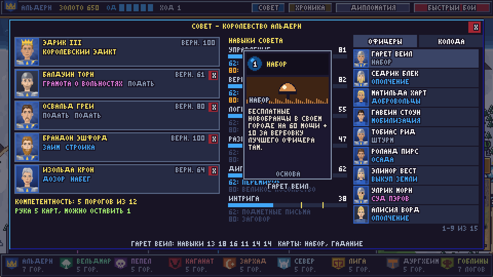
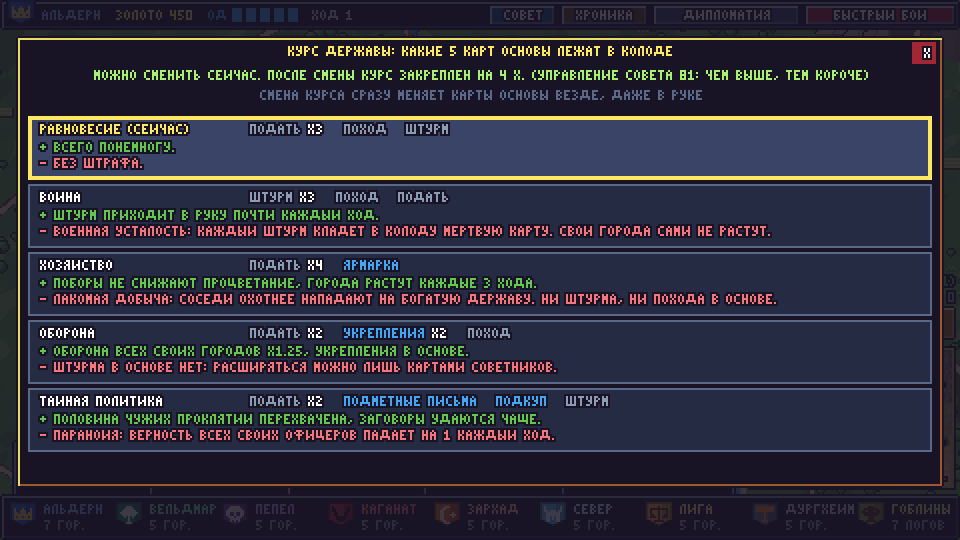

# Карты действий

Всё, что держава делает на карте мира, — это **карты действий**: сбор налогов, походы, штурм
городов, найм, дипломатия и интриги. Код: `game/cards.py` (каталог, личные карты, сборка колоды),
`game/cardplay.py` (цели и эффекты), `game/campaign.py` (ход, бои), `game/campaign_ai.py`
(компьютерные державы), `game/cardsim.py` (баланс), `game/cardui.py` (интерфейс).


## Ход

- В начале хода у державы **5 ОД** (очков действий). **Каганат: 6 ОД** — пассивная особенность Орды.
- Карты стоят от 0 до 3 ОД, некоторые ещё и золото. Неистраченные ОД сгорают.
- Рука — **5 карт**, у компетентного совета 6. Новая рука тянется **в конце** своего хода, поэтому
  соперники видят и портят её между ходами (лазутчики, всевидящее око, тайный аукцион).
- В конце хода держава платит жалованье войскам. Если золота не хватает, часть войск разбегается.
- Сыгранные карты уходят в сброс. Когда колода кончается, сброс перемешивается в новую колоду.
  Карты с пометкой «сгорает» после розыгрыша исчезают навсегда.

## Колода

1. **Основа державы** — 6 карт; какие именно, задаёт **курс державы** (ниже). На курсе «Равновесие»:
   две ПОДАТИ, ОТКУП ОТ ОРДЫ, ПОХОД, ШТУРМ и СБОР ВОЙСК (у гоблинов вместо откупа третья подать).
2. **Карта фракции** — одна, своя у каждой державы. Её приносит лидер, а он всегда сидит в совете.
3. **Личные карты советников**. В совете 5 мест: лидер и четыре советника. У каждого офицера 1–2 личные карты
   (см. карточку офицера). Одни приносят единственные в мире карты, другие — пустяки.
4. **Пороговые карты**. Сумма каждого из шести навыков у совета, достигшая 62, даёт дельную карту, а
   достигшая 80 — ещё и сильную. Совет из пяти «двадцаток» получил бы все 12.
5. **Проклятия**, которые подбросили соперники.

Кампания начинается с пустым советом: в нём только правитель. Советников назначает игрок (окно СОВЕТ), ИИ рассаживает свой совет в первый же ход.

**Дилемма совета.** Самые способные офицеры чаще всего приносят пустяки: у двух лучших офицеров каждой
державы личные карты — только пустяки и основа. А уникальные карты фракции почти всегда достаются
слабым офицерам. Взять в совет слабого владельца уникальной карты — значит потерять пороги, а значит,
и пороговые карты, и всё остальное, что даёт компетентность совета.

**Компетентность совета** — сколько порогов из 12 он взял. Кроме карт она даёт:
- 6+ порогов: рука из 6 карт вместо 5;
- 3+ порогов: одну карту можно оставить на следующий ход (ПКМ по карте), 8+ порогов — две;
- разведка совета 62+: треть подброшенных проклятий перехватывается;
- 0–1 порогов — **распри**: раз в три хода в свою колоду ложится мёртвая карта «Распри в совете».

Смена совета сразу пересобирает колоду: карты уволенных уходят отовсюду, даже из руки, карты новых
советников замешиваются в колоду, пороговые карты пересчитываются. Уволенный теряет 20 верности.



## Курс державы

Курс решает, какие 6 карт основы лежат в колоде. Его меняют прямо во время кампании (окно СОВЕТ ->
КУРС, в свой ход). Карты основы заменяются сразу и везде, даже в руке. После смены курс закреплён:
10 ходов минус 1 за каждые 6 очков УПРАВЛЕНИЯ совета сверх 40, но не меньше 3. Чем лучше совет
управляет державой, тем гибче её политика. ИИ выбирает курс по обстановке: бедность -> хозяйство,
враг у стен -> оборона, слабый сосед -> война.

| Курс | Карты основы | Плюс | Штраф |
|---|---|---|---|
| Равновесие | Подать x2, Откуп от орды, Поход, Штурм, Сбор войск | Всего понемногу. | Без штрафа. |
| Война | Штурм x2, Откуп от орды, Поход, Подать, Сбор войск | Штурм приходит в руку почти каждый ход. | ВОЕННАЯ УСТАЛОСТЬ: каждый штурм кладёт в колоду мёртвую карту. Свои города сами не растут. |
| Хозяйство | Подать x2, Откуп от орды, Ярмарка, Золотой век, Сбор войск | Поборы не снижают процветание, города растут каждые 3 хода, Золотой век в основе. | ЛАКОМАЯ ДОБЫЧА: соседи охотнее нападают на богатую державу. Ни штурма, ни похода в основе. |
| Оборона | Подать, Откуп от орды, Укрепления, Вылазка, Поход, Сбор войск | Оборона всех своих городов x1.25, укрепления и вылазка в основе. | Штурма в основе нет: расширяться можно лишь картами советников. |
| Тайная политика | Подать, Откуп от орды, Подметные письма, Подкуп, Штурм, Сбор войск | Половина чужих проклятий перехвачена, заговоры удаются чаще. | ПАРАНОЙЯ: верность всех своих офицеров падает на 1 каждый ход. |

Это основа людей. У гоблинов вместо ОТКУПА ОТ ОРДЫ — подать (или штурм на курсе войны), а карты, которые им не к лицу, заменены своими: Ярмарка -> Барахолка, Золотой век -> Жирный год, Подметные письма -> Пакости (а пороговые Перемирие -> Запугивание, Великое посольство -> Великий страх).



## Процветание и доход

У каждого города есть **процветание** от 1 до 10. ПОДАТЬ приносит процветание x20 золота плюс 2 за
управление лучшего офицера в городе. Если собирать подать в одном городе два хода подряд, процветание
падает на 1. Город, где подать не собирали 4 хода, растёт на 1. Расти город может не выше
стартового процветания +2. Ярмарки, реформы и стройки поднимают процветание, а набеги,
осады, диверсии, чума и захват города — снижают. Выше стартового уровня город растёт сам втрое медленнее.

**Бои разоряют.** Каждый бой в городе отнимает 1 процветания с шансом от 100% до 50%: чем выше ЛОГИСТИКА
совета (сумма 40 и меньше — 100%, 80 и больше — 50%) той державы, чей город **после боя**, тем меньше шанс
(обозы, вывоз раненых, отстройка). Два боя за 5 ходов — город **разорён** и 4 хода не растёт.

**Порядок.** У каждого города людей есть ПОРЯДОК (0–10). Каждый ход он сдвигается на 1 к тому, что город может
удержать: 5, +1 за наместника (офицера в городе) и ещё +1, если его РАЗВЕДКА 14+, +1/+2 за гарнизон в 300/700
мощи, +1 храм, +1 столица; богатство манит воров — −1 за каждое очко процветания выше 6; болезнь −2,
смута в державе −1. Бой в городе −2, набег −1, поборы −1, взятый город начинает с 3. Ниже 4 случаются беды
(шанс 15% за каждое очко ниже 4): ВОРОВСКОЙ ПРИТОН (процветание −1, подать там на 30% меньше, пока порядок не
поднимется до 6), БУНТ ЧЕРНИ (процветание −1, гарнизон теряет воина), КОНТРАБАНДИСТЫ (казна теряет золото).
Тень орды (пассивная черта гоблинов): город у логова теряет 2 порядка, если его держава не откупилась, а
краденое там уходит гоблинам — добыча контрабандистов и половина того, что притон срезает с подати.
ГОРОДСКАЯ СТРАЖА (порядок +4, притон разогнан) и ВОРОВСКАЯ ГИЛЬДИЯ (вражеский город: порядок −4 и притон) —
личные карты нескольких офицеров.
Так богатые города без наместника и гарнизона сами скатываются назад, и к концу кампании общее процветание
нередко близко к начальному.

| Держава | Города: стартовое процветание |
|---|---|
| Альдерн | Кронхольм 8, Святой Аларий 5, Эшфорд 4, Хартвел 7, Люмен 6, Северный Брод 3, Западная Застава 3 |
| Вельдмар | Сильваэн 7, Лунная Поляна 5, Корни Мира 4, Тихая Заводь 5, Серебряный Ручей 3 |
| Пепел | Мор-Кхаар 6, Чумной Брод 3, Курган Королей 4, Пепельная Гавань 5, Серый Монастырь 4 |
| Каганат | Карак-Ор 4, Кара-Орду 5, Кровавый Брод 2, Курган Предков 3, Степной Стан 4 |
| Зархад | Зархад 9, Порт Бахри 7, Оазис Сафир 5, Красные Барханы 3, Медный Минарет 5 |
| Север | Скальвик 5, Хьёльдгард 6, Волчья Падь 4, Снежный Курган 2, Белый Рог 5 |
| Лига | Вальмарра 9, Корвина 7, Аурелия 7, Солёный Мыс 3, Тремонт 6 |
| Дургхейм | Дургхейм 7, Железная Пасть 6, Глубинный Горн 5, Каменный Страж 3, Серебряная Жила 6 |
| Гоблины | Гнилая Куча 2, Пиратская Отмель 2, Грибная Нора 1, Ржавая Свалка 2, Гоблинские Пещеры 1, Вонючая Топь 1, Красная Скала 1 |

## Война

**Настоящий бой.** Если штурмуете вы или штурмуют вас, штурм идёт как настоящий автобой: слева
отряды нападающих (до 18 воинов, сильнейшие), справа защитники и городское ополчение (стены и
горожане превращаются в ополченцев, до 8). Бои между другими державами игра предлагает посмотреть
или рассчитать (можно выбрать «всегда считать»; переключатель — в окне хроники). ESC в бою — сразу к
итогу.

**Павшие, раненые, бежавшие.** Каждый павший в бою воин бросает жребий. У победителей он может
оказаться раненым и вернуться в строй: 20% + 1,5% за каждое очко ЛОГИСТИКИ его офицера. У
проигравших защитников он может бежать в соседний свой город: 10% + 1,5% за ЛОГИСТИКУ, умноженное
на 0,5–1 в зависимости от того, насколько разгромным было поражение. Остальные гибнут.

Если бой рассчитывается: сила нападающих — сумма мощи их отрядов с учётом баффов. Защита города —
отряды офицеров и свободные воины в нём, плюс ополчение города (зависит от типа и процветания), всё
умножено на стены (столица x1.25, крепость x1.3, форт x1.2, логово x1.1). Укрепления усиливают
оборону, осада ослабляет. Шанс победы равен A^2.5 / (A^2.5 + D^2.5), и перед штурмом его видно.
Победители занимают город. Проигравшие отступают в соседний свой город, а если отступать некуда,
попадают в плен и могут присягнуть победителю (тем вероятнее, чем ниже их верность). Держава без
городов пала, её офицеры переходят к победителю. Офицер, который сходил или штурмовал, до конца хода
не готов (снова сделать его готовым может ПРОВИАНТ).

Небольшие пассивные особенности: **Каганат** получает +1 ОД, нежить **Пепла** просит лишь 40% жалованья,
а в родных лесах **Вельдмара** оборона x1.2.

## Ответы

Карты-ответы нельзя сыграть в свой ход: они лежат в руке и срабатывают в чужой. ЗАСАДА, ВЫЛАЗКА,
ПОДКРЕПЛЕНИЕ и ОТХОД — когда штурмуют ваш город (игроку предлагается выбрать, чем ответить);
ПЕРЕХВАТ ГОНЦА — когда соперник подбрасывает вам проклятия. Поэтому оставить карту на следующий ход
(запас компетентного совета) — настоящее решение.

## Прореживание колоды и пороки

ЧИСТКА КАНЦЕЛЯРИИ (второй порог УПРАВЛЕНИЯ, 80+) навсегда сжигает карту из руки — хоть проклятие, хоть
порок, хоть лишнюю основу — и тянет новую. Ещё один способ — уволить советника: его карты уходят из
колоды. Увольнение стоит верности: уволенный теряет 20, а назначенный получает лишь +8.

**Пороки.** У 30 офицеров (по три на каждый из 10 пороков, чаще у способных) есть карта порока. Она
входит в колоду вместе с ним и вредит: ЛЕНЬ — мёртвая карта в руке; КАЗНОКРАДСТВО, ГРУБОСТЬ, ЗАВИСТЬ,
ПЬЯНСТВО, ТРУСОСТЬ, БОЛТЛИВОСТЬ, АЗАРТ, ЖЕСТОКОСТЬ, ГОРДЫНЯ срабатывают, когда их вытянули. Порок
остаётся в колоде, пока советник в совете или пока карту не сожгли чисткой. Порок упомянут и в
биографии офицера.

## Проклятия

Соперник замешивает их в вашу колоду. **Мёртвые** (Смута, Распри, Усталость) просто занимают место в
руке и через несколько ходов исчезают. **Срабатывающие** (Пожар, Чума, Дезертирство, Галлюцинации,
Долг) действуют в момент, когда их вытянули, — даже в чужой ход. От них спасают КОНТРРАЗВЕДКА и
СУД ПЭРОВ, а разведка совета перехватывает их на подходе.

## Сбор войск

Нанимать воинов можно только в городе, где идёт **СБОР ВОЙСК** (1 ОД, карта основы на любом курсе,
одна на колоду). Обычно найм открыт только на этот ход; совет с ВЕРБОВКОЙ 62+ держит его 2 хода,
с ВЕРБОВКОЙ 80+ — 3 хода. В окне города видно, сколько ещё открыт найм.

## Опыт и рост офицеров

Офицер копит опыт: победа в бою +25, поражение +10, сыгранная его карта +8, каждый ход
в совете +2, служба в гарнизоне +5 за ход. Опыт умножается на **способность к учёбе**: она
зависит от того, каким офицер был в начале кампании — у самых заурядных до x3,2, у выдающихся x0,2.
Уровень требует 60 + 10 x уровень опыта. С уровнем офицер получает +1 к навыку (в половине случаев к
сильнейшему, иначе к случайному) или, реже, +20 лидерства. Навыки растущих советников сразу
пересчитывают пороги совета, а ИИ-правители ценят в совете опыт и навыки и пересаживают туда выросших.

Падать тоже можно: тяжёлое поражение (силы меньше 60% вражеских) с шансом 20% ранит офицера (-1 к
сильнейшему навыку), а знаменитый офицер, который долго ничего не делает, может «почить на лаврах».

По 64 кампаниям (`python -m game.cardsim 64 40`): самая заурядная пятая часть офицеров вырастает в
среднем на 5–6 уровней, каждый пятый — на 5+ навыков, и каждый шестой попадает в совет. Самые
сильные растут медленно, а каждый седьмой из них за кампанию теряет навык.

## Подвиги

Карты подвигов даются не за уровень, а за редкое деяние, и каждая — **одна на всю кампанию**: кто
первым совершил, тот и получил (карта становится его личной картой, +15 верности). Чем труднее подвиг,
тем сильнее карта. Как часто подвиг совершается хоть кем-то за 40 ходов — в таблице баланса ниже.

| Подвиг | Условие | Карта |
|---|---|---|
| Герой брода | удержать город, когда шанс устоять был не выше 15% | Свой офицер: +35% силы на 3 хода, верность 100. |
| Гроза гоблинов | участвовать во взятии 2 гоблинских логов | Трофеи: +150 золота и новобранцы на 120 мощи в своём городе. |
| Золотой наместник | быть лучшим управленцем в городах державы, когда 4 из них расцвели до предела | +50 золота за каждый свой город с процветанием 7+. |
| Первый на стене | взять штурмом столицу державы, когда шанс был меньше половины | Штурм соседнего города с +25% силы. |
| Несокрушимый | выиграть 8 боёв подряд | Свой офицер снова готов, его отряд +20% силы на 2 хода. |
| Миротворец | сидеть в совете, когда у державы 7 договоров о мире и союзе сразу (лучший дипломат совета) | Мир на 10 ходов с державой при отношениях 20+. |
| Победитель гигантов | победить, когда сила врага была втрое больше | Все ваши отряды +20% силы на 3 хода. |
| Легенда войны | дорасти до 10 уровня | Штурм из городов в 3 дорогах от цели, +40% силы. |

## Верность

Верность (0–100) растёт, когда играют карты советника (+2), при назначении в совет (+8), за подвиги
(+15) и за взятые города (+1 всем). Падает, когда советника не слушают (5+ ходов без его карт: -1 за
ход), при увольнении (-20), когда держава теряет город (-2 всем, столицу -8: авторитет правителя
рушится), когда казна не платит войскам (-1 всем), на курсе интриг. Что она даёт:

- **100 — предан**: его карты стоят на 1 ОД меньше, его отряд бьётся на 15% сильнее. Встречается редко
  и легко теряется — одно неудачное решение, и бонуса нет.
- **90+**: ПОДКУП не действует вовсе (золото возвращают), ЗАГОВОР удаётся намного реже.
- **ниже 35**: советник ропщет — иногда сам подкладывает СМУТУ в колоду своей державы.
- **ниже 30**: его отряд бьётся вполсилы (-10%).
- **ниже 20**: может уйти со всем отрядом к соседу, с которым у его державы лучшие отношения.

## Смена правителя

Правитель никогда не меняет сторону: его нельзя подкупить, переманить заговором или взять в плен. Но он смертен:
в проигранном бою он гибнет с шансом 12% (в выигранном — 2%), при падении города без
дороги к своим он бежит далеко или гибнет, раз в ход его может унести болезнь (0.8%), а с падением
державы гибнет и он.

**Наследника нельзя назначить** — его выбирает двор по заслугам: заслуги растут за каждый ход в совете (+3),
каждую сыгранную карту офицера (+1), каждую победу в бою (+4, поражение −1) и подвиг (+15); учитываются ещё
обаяние, уровень и верность. Перебежчики наследуют, только если больше некому. Влиять на выбор можно лишь
косвенно: кого сажать в совет, чьи карты играть, кого вести в бой. Окно совета показывает вероятного
преемника (наведи на место правителя — увидишь заслуги первых трёх).

**Плен.** Когда город взят, его офицеры отходят в соседний свой город (верность −5). Если отходить некуда,
офицер в плену: он может присягнуть победителю (тем вероятнее, чем ниже его верность; при кровной вражде —
никогда; если у его державы не осталось городов — всегда) или возвращается в ближайший свой город без
отряда. Правитель в плен не сдаётся: он бежит далеко или гибнет. Победитель-ИИ решает по нраву правителя:
жестокий обычно казнит пленных (отношения −10), милосердный отпускает домой (отношения +5).

**Болезнь** грозит только правителям: после 5-го хода каждый ход 0,5% (за 40 ходов около 17%). Мор
(событие «Чума») бьёт по войскам и процветанию, но не по офицерам.

**Карты.** Первый правитель приносит карту фракции. Новый правитель переходит на место главы совета (его
место советника освобождается), его собственные карты становятся картами правителя. Карты умершего
правителя остаются в колоде как **наследие** — но только одного, последнего: при следующей смерти старое
наследие (и карта фракции вместе с ним) уходит. Пороки наследием не становятся.

**Политическая нестабильность** (6 ходов) после каждой смены, чтобы терять правителя нарочно
было невыгодно: −1 ОД каждый ход, курс заблокирован, верность всех офицеров −15 (обойдённых советников −23),
2 СМУТЫ в колоду, каждый ход 25% что неверный офицер (верность < 45) объявит себя претендентом и уйдёт с
отрядом к соседу; ИИ охотнее штурмует такую державу и неохотно вступает с ней в союз. Верность правителя
всегда 100 и ни на что не влияет — бонусы за полную верность получают только советники.

Проверка (96 кампаний, лидер одной державы убит на 3-м ходу, сравнение на 30-м ходу с той же
кампанией без этого): в среднем −0,61 города и −330 мощи армии; держава слабее в 49% кампаний, сильнее лишь в 41%.

## Болезни и новые люди

В колоде каждой державы лежит карта **БОЛЕЗНЬ В ГОРОДЕ**. Вытянув её, держава сразу её сбрасывает и
берёт другую карту, а в одном из своих городов вспыхивает болезнь (чаще там, где больше офицеров):
3 хода каждый офицер в этом городе в начале хода умирает с шансом 4%, но не больше одного за ход (в городе с храмом
вдвое реже) — правитель тоже, и тогда трон наследуют. Лазареты рядом могут остановить болезнь, ЛЕКАРЬ
лечит город и бережёт его 6 ходов. Событие «Чума» кладёт в каждую колоду ещё 2 болезни на
10 ходов.

Чтобы мир не пустел, подрастают **молодые таланты** (имена из заготовленного пула каждой фракции): карта
совета ПОИСК ТАЛАНТОВ (первый порог ВЕРБОВКИ, вместо Вербовщиков) приводит офицера в выбранный город
(с академией — двоих), а держава, у которой офицеров меньше, чем в начале, находит их и сама — тем
быстрее, чем больше недобор и чем больше академий. Новичок слаб, но учится быстро; больше 24
офицеров у державы не бывает.

## Здания

В городе 2 места для зданий (в столице 3, в логове 1), каждое здание — один раз. Строят в окне города
(кнопка СТРОЙКА) за золото и 1 ОД; МАСТЕР-ЗОДЧИЙ строит за полцены. Здания рушатся: набег на город
сжигает одно с шансом 50%, отбитый штурм — с шансом 20%, а при захвате города каждое гибнет с
шансом 40%; САПЁРЫ рушат здание в соседнем вражеском городе.

| Здание | Цена | Что даёт |
|---|---|---|
| Лазарет | 150 | Останавливает болезнь в этом и соседних своих городах с шансом 50% (два лазарета рядом - 75%, три - 87%). |
| Рынок | 200 | ПОДАТЬ, собранная в этом городе, приносит на 50% больше. |
| Башня | 220 | В бою за город стреляет по штурмующим как усиленный лучник; в расчётном бою +110 к обороне. |
| Казармы | 180 | Найм здесь на 20% дешевле, СБОР ВОЙСК длится на ход дольше. |
| Стены | 260 | Оборона города x1.25. |
| Храм | 160 | Верность офицеров в городе +1 каждый ход, болезнь здесь вдвое менее смертельна. |
| Академия | 200 | Офицеры в городе учатся в гарнизоне вдвое быстрее; молодые таланты появляются здесь и вдвое чаще. |

## Орда гоблинов

Гоблины не играбельны и не ведут дипломатии (вечная война со всеми), но у них есть свой совет, колода,
курсы, наследование и новые вожди. Обычных зданий орда не строит. Вместо этого, накопив **540 золота**, она
один раз за кампанию возводит в логове **великую постройку** — и с тех пор играет в её манере (выбор зависит
от вожака: жестокий тянется к яме, агрессивный к тотему, вербовщик к загону). Когда постройка возведена,
игрок видит большую карту «ОРДА УСИЛИЛАСЬ». Если логово с постройкой взято, она сгорает; орда может
возвести её снова, но только ту же. С 4-го хода орда копит на постройку и нанимает меньше; примерно
в половине кампаний она успевает её возвести.

| Постройка | Манера | Что даёт |
|---|---|---|
| Тотем войны | Боевой дух | Гоблины штурмуют и держат логова на 30% сильнее - и на карте, и в настоящих боях. |
| Яма с пленными | Выкуп или жертва | Часть павших врагов в боях, выигранных гоблинами, пленник с каждого набега и улов ночных ловцов из соседних городов попадают в яму. Каждый ход пленников выкупают их державы (золото орде) или приносят в жертву (из ямы лезут безумные гоблины). Орда чаще ходит в набеги. |
| Загон варгов | Дешёвые всадники | Наездников на лютоволках нанимают в любом логове без сбора войск, за полцены и с половинным содержанием; загон сам выводит новых. |

**Откуп.** У каждой державы людей в основе лежит ОТКУП ОТ ОРДЫ (вместо одной подати): 60 золота + 30 за каждый
свой город у логов, и 4 хода орда не штурмует и не грабит эту державу, а она не трогает
логова. Золото уходит орде — откупаясь, люди сами приближают её великую постройку. Если орды рядом нет,
собранное на откуп серебро остаётся в казне (+15 золота за каждый город). ГОБЛИНСКИЙ ТОЛМАЧ даёт 4 хода
такого мира бесплатно, ОХОТНИКИ ЗА ГОЛОВАМИ бьют гоблинов в соседнем логове.

## Типы правления

У каждого офицера есть тип правления — из трёх поведенческих черт. Он действует и виден, только пока офицер
правит державой ИИ (в его карточке и в окне дипломатии); у правителя игрока и у остальных офицеров он скрыт.
Тип складывается из навыков офицера (интриган — высокая ИНТРИГА, строитель — УПРАВЛЕНИЕ, завоеватель —
ВЕРБОВКА и ЛОГИСТИКА...) и его пороков; первые правители держав правят так, как велит их история.

ИИ дорожит правителем: сам он идёт на штурм, только если шанс не ниже 80% (храбрый — 65%, бережёт себя —
90%). Если без него штурм тоже удаётся — идут другие. Если иначе никак, правитель рискует собой лишь при
высоких ставках: у державы осталось 1–2 города или цель — её собственная бывшая столица. Риск гибели
правителя вычитается из выгоды штурма.

| Тип | Черты |
|---|---|
| Тиран | Жестокий, Агрессивный, Подозрительный |
| Завоеватель | Завоеватель, Храбрый, Вербовщик |
| Мудрец | Осторожный, Строитель, Дипломат |
| Торговый князь | Алчный, Торговец, Скряга |
| Интриган | Интриган, Вероломный, Стервятник |
| Благородный вождь | Благородный, Храбрый, Милосердный |
| Хранитель | Оборонец, Традиционалист, Бережёт себя |
| Реформатор | Реформатор, Меритократ, Строитель |
| Мститель | Мстительный, Безрассудный, Воинственный |
| Покровитель | Щедрый, Набожный, Кумовство |
| Властолюбец | Честолюбивый, Ценитель лучших, Агрессивный |
| Стратег | Стервятник, Бережёт себя, Реформатор |
| Полководец | Агрессивный, Храбрый, Вербовщик |
| Захватчик | Завоеватель, Безрассудный, Жестокий |
| Деспот | Жестокий, Подозрительный, Кумовство |
| Купец-дипломат | Торговец, Дипломат, Алчный |
| Зодчий державы | Строитель, Оборонец, Скряга |
| Ревнитель веры | Набожный, Благородный, Агрессивный |
| Теневой правитель | Интриган, Подозрительный, Бережёт себя |
| Крестоносец | Благородный, Завоеватель, Храбрый |
| Скупой владыка | Скряга, Традиционалист, Осторожный |
| Выскочка | Честолюбивый, Безрассудный, Меритократ |
| Отец народа | Щедрый, Строитель, Милосердный |
| Наёмный князь | Алчный, Вероломный, Ценитель лучших |
| Истребитель орд | Гроза гоблинов, Храбрый, Завоеватель |
| Откупщик | Данник орды, Осторожный, Торговец |
| Великий вожак | Жадный до блестяшек, Агрессивный, Безрассудный |
| Король кучи | Жадный до блестяшек, Алчный, Жестокий |

| Черта | Что делает |
|---|---|
| Агрессивный | военные карты ценит на 30% выше |
| Осторожный | штурмует только при шансе 65% и выше |
| Безрассудный | идёт на штурм уже при шансе 45% |
| Жестокий | пленных офицеров обычно казнит |
| Милосердный | пленных отпускает домой, их держава за это благодарна (+5) |
| Алчный | карты хозяйства ценит на 30% выше, тянется к курсу хозяйства |
| Щедрый | раз в 3 хода верность всех его офицеров +1 |
| Подозрительный | защиту от интриг ценит вдвое; верность забытых советников падает вдвое быстрее |
| Интриган | карты интриги ценит на 40% выше, тянется к тайной политике |
| Дипломат | вдвое охотнее шлёт послов с миром и союзом |
| Воинственный | мира не просит и неохотно его принимает (-15) |
| Благородный | никогда не нарушает договоров |
| Вероломный | разрывает перемирия втрое охотнее |
| Строитель | процветание городов ценит на 40% выше, бережёт их от поборов |
| Оборонец | карты обороны ценит на 40% выше, тянется к курсу обороны |
| Завоеватель | вражеские города ценит на 25% выше, тянется к курсу войны |
| Скряга | держит в казне запас на 3 хода содержания, нанимает меньше |
| Вербовщик | найм и сбор войск ценит на 40% выше |
| Ценитель лучших | нанимает только сильных воинов, ополченцев и псов не берёт |
| Торговец | вдвое охотнее предлагает торговлю и охотнее её принимает (+10) |
| Храбрый | сам ведёт войска в бой уже при шансе 65% |
| Бережёт себя | сам идёт в бой лишь при шансе 90% или в безвыходном положении |
| Кумовство | в совет сажает самых верных, а не самых способных |
| Меритократ | в совет сажает самых способных и пересматривает его вдвое чаще |
| Мстительный | того, кто штурмовал его города, бьёт в первую очередь (+50%) |
| Стервятник | бьёт ослабленных: державы в смуте и терявшие города (+40%) |
| Набожный | подлых интриг избегает (-50%), отношения с соседями медленно растут |
| Традиционалист | меняет курс державы лишь при большой выгоде |
| Реформатор | меняет курс, как только это выгоднее |
| Честолюбивый | союзов не ищет, метит в сильнейших (+30% к штурмам их городов) |
| Гроза гоблинов | логова штурмует охотнее (+50%), от орды не откупается |
| Данник орды | откуп от орды ценит вдвое: лучше платить, чем воевать с гоблинами |
| Жадный до блестяшек | вождь орды: копит всё золото на великую постройку |

## Дипломатия

Пары держав по умолчанию воюют. Договор — **мир** или **союз** (союзники тоже в мире) — заключается
предложением: окно ДИПЛОМАТИЯ, кнопки МИР / СОЮЗ / ТОРГОВЛЯ, каждое посольство стоит 1 ОД. Карты
ПЕРЕМИРИЕ, ТОРГОВЫЙ ДОГОВОР и ВЕЛИКОЕ ПОСОЛЬСТВО — те же предложения, но с дарами (+20/+35 к согласию).
Компьютерные державы шлют посольства и друг другу, и игроку — тогда появляется окно с их предложением и
доводами ваших советников, решать вам.

Другая сторона взвешивает предложение (`diplomacy.evaluate`), и окно заранее показывает каждый довод с его весом:

- отношения (главное); кто сильнее (слабому мир нужнее); войны на других фронтах; недавно потерянные города;
- свежая обида (штурм за последние 3 хода); ваши прошлые вероломства; страх перед гегемоном;
- общая граница (без неё мир ничего не стоит); лёгкая добыча в ваших городах; их курс (война/интриги против,
  хозяйство/оборона за); искусство ваших послов (ДИПЛОМАТИЯ совета) и подозрительность их совета (ИНТРИГА);
- для союза — общий враг (гегемон рядом), общие соседи-враги, сила союзника, число уже имеющихся союзов;
- для торговли — их курс хозяйства и пустая казна.

**Мир** длится 6 ходов (с картой — 8–10). **Союз** — 12 ходов: союзники помогают в
штурмах и обороне — 25% силы своих офицеров, стоящих рядом с городом (при братстве 40%), и их отряды выходят
на поле в настоящем бою. У союза может быть **общий враг** — союзные ИИ предпочитают бить его.
**Разрыв** договора — вероломство: отношения с жертвой −25, со всеми прочими −6, союзники жертвы встают на её
сторону, а ваши послы долго встречают недоверие.

**Гегемон** — держава, чья сила (города и армия) в 1.3 раза выше средней. Пока он есть, его отношения
со всеми падают на 1 каждый ход, соседи гегемона сближаются, союзы против него заключаются охотнее, а ИИ чаще
штурмует его города. Так сам собой складывается сговор против лидера.

### Что дают отношения

| Отношения | Уровень | Последствия |
|---|---|---|
| 1–14 | Кровная вражда | Обе стороны бьются насмерть: +15% силы и в штурме, и в обороне друг против друга. Мир, союз и торговля невозможны. Пленные не присягают. |
| 15–34 | Вражда | Ни торговли, ни союза. Пограничные с ними города (если нет мира) растут на ход дольше. |
| 35–64 | Нейтралитет | Обычные отношения: возможны мир и торговля. |
| 65–84 | Дружба | Дружеская торговля: золото каждый ход обеим сторонам. Союз возможен. |
| 85–100 | Братство | Двойная дружеская торговля. Союзная помощь в боях сильнее (40% вместо 25%). |

Отношения сами медленно возвращаются к исторической памяти народов, если между державами давно не было
штурмов; союз даёт +2 за ход, торговля +1.

## События мира

Раз в среднем в 20 ходов (шанс 9% за ход, не раньше 6-го хода и не чаще раза в 8 ходов)
случается событие, которое касается всех держав сразу. Оно показывается большой картой, длящиеся события
видны в верхней строке. Влияние каждого измерено: `python -m game.cardsim events 48` — 48 кампаний с событием
на 15-м ходу против тех же кампаний без него.

| Событие | Что происходит |
|---|---|
| Чума на материке | Мор идёт от богатейшего города на 2 дороги вокруг: процветание -4/-3/-2, гарнизоны теряют до 60% воинов (нежить Пепла не болеет); в каждую колоду ложатся ещё 2 БОЛЕЗНИ В ГОРОДЕ на 10 ходов. |
| Нашествие гоблинов | Гоблины отбивают до 3 слабейших своих логов, во всех логовах новые орды; гоблинские вожди на службе людей могут вернуться к своим. |
| Великая стужа | 3 хода: содержание войск +30% (Север и Дургхейм привычны к холоду), города не растут. |
| Ярмарка в лиге | Лига +350 золота, каждый гость (мир с Лигой или отношения 50+) +150 золота и отношения +8. |
| Золотая жила | В городе одной из трёх слабейших держав нашли золото: процветание 10, +600 в казну и ополчение рудокопов; соседи завидуют (отношения -6). |
| Крестьянская война | У сильнейшей державы 3 покорённых города возвращаются прежним хозяевам (павшие державы возрождаются). Нет покорённых - три города разорены. |
| Хвостатая звезда | Дурное знамение: верность всех офицеров -6, у двух сильнейших держав -15 и по 2 СМУТЫ в колоду. |
| Воззвание пророка | Все против сильнейшей державы: её договоры расторгнуты, отношения со всеми -25, между прочими +10. Рождается коалиция. |
| Вольные роты | Наёмники идут к слабым: три слабейшие державы получают отряды на 520 мощи в столице, следующие две - на 220. |
| Великая засуха | 4 хода подати приносят лишь 40% золота. Большие армии начнут разбегаться. |

```
влияние событий: 48 кампаний, событие на ходу 15, сравнение через 12 ходов

СОБЫТИЕ          ГОР.МАКС.СДВИГ АРМИЯ ВСЕГО ЛИДЕР ГОР. СЛАБЫЕ ГОР.  РАЗБРОС  ПАЛО
(без события)                         22311       7.75        4.65     2.30  0.06
plague              СЕВЕР +0.50         -2%      -0.10       -0.01    +0.11 -0.02
goblin_horde      ГОБЛИНЫ +1.10         +2%      -0.79       +0.01    -0.10 +0.02
frost             КАГАНАТ -0.56         -3%      +0.15       -0.18    +0.10 -0.04
fair                СЕВЕР +0.40         +2%      -0.06       -0.08    +0.13 +0.00
gold_rush           СЕВЕР +0.38         -2%      +0.09       -0.11    +0.10 -0.02
revolt            АЛЬДЕРН -0.85         +2%      -0.28       +0.10    -0.05 -0.04
omen                СЕВЕР +0.48         -0%      -0.32       +0.03    +0.02 -0.02
prophet             СЕВЕР +0.40         -0%      -0.20       -0.05    +0.01 -0.02
free_companies    ГОБЛИНЫ +0.37         +3%      -0.15       +0.09    -0.06 -0.02
drought             СЕВЕР +0.42         -6%      -0.08       -0.01    +0.04 +0.00
```

## Все карты

### Основа

| Карта | ОД | Вид | Действие | Откуда |
|---|---|---|---|---|
| Откуп от орды | 1 | Дипломатия | Орде 60 золота + 30 за каждый свой город у логов: 4 хода мир с гоблинами. Если орды рядом нет: +15 золота за каждый свой город. | основа людей (вместо одной подати; на курсе войны - вместо штурма) |
| Подать | 1 | Хозяйство | Собрать налог в своём городе: процветание x20 золота. Два хода подряд в одном городе - процветание -1. | основа x3, у 22 офицеров |
| Поход | 1 | Война | До 3 офицеров с отрядами идут в соседний свой город. | основа x1, у 10 офицеров |
| Штурм | 2 | Война | До 3 офицеров из соседних городов штурмуют вражеский город. Победа - город ваш. | основа x1, у 13 офицеров |
| Набор | 1 | Набор | Бесплатные новобранцы в своём городе на 60 мощи + 10 за вербовку лучшего офицера там. | у 28 офицеров |
| Сбор войск | 1 | Набор | Открыть найм в своём городе на этот ход. Вербовка совета 62+: ещё на 1 ход, 80+: ещё на 2. |  |

### Карты фракций

| Карта | ОД | Вид | Действие | Откуда |
|---|---|---|---|---|
| Караваны пустыни | 1 | Хозяйство | +45 золота за каждую державу, с которой мир или отношения 40+. Порт: процветание +1. | Зархад |
| Королевский эдикт | 1 | Хозяйство | Каждый свой город: процветание x6 золота. Без штрафа за поборы. | Альдерн |
| Великий набег | 2 | Война | Все вражеские города у ваших границ разграблены: процветание x8 золота с каждого, процветание там -1. | Каганат |
| Драккары | 2 | Война | До 3 офицеров из своих портов штурмуют любой вражеский порт по морю, без дорог. | Север |
| Книга обид | 1 | Война | Соперник вписан в Книгу: 6 ходов ваши отряды против него +30% силы. Верность совета +10. | Дургхейм |
| Тропы древа-матери | 0 | Война | До 3 офицеров переходят из своего города в любой свой без дорог и остаются готовы. Там оборона x1.3 на 2 хода. | Вельдмар |
| Выводок | 1 | Набор | В каждом логове вылупляются гоблины на 110 мощи. | Гоблины |
| Жатва | 1 | Набор | Мёртвые встают: в каждом своём городе нежить на 40 мощи, в столице - на 90. | Пепел |
| Золотой контракт | 1 | Набор | Нанять в свой город до 3 воинов из пула ЛЮБОГО города мира за 1.25 цены. | Лига |

### Сильные (второй порог)

| Карта | ОД | Вид | Действие | Откуда |
|---|---|---|---|---|
| Чистка канцелярии | 1 | Совет | Сжечь навсегда одну карту из руки (хоть проклятие) и вытянуть новую. | Управление 80+ |
| Великое посольство | 2 | Дипломатия | Отношения +15 в любом случае. Предложить мир (а при мире - союз) с +35 к согласию на 10 ходов; при согласии ещё и торговля по 30 золота. | Дипломатия 80+ |
| Жирный год | 2 | Хозяйство | Два беднейших своих логова: процветание +1. Каждое логово: процветание x6 золота. | у гоблинов вместо «Золотой век» |
| Золотой век | 2 | Хозяйство | Два беднейших своих города: процветание +1. Каждый свой город: процветание x6 золота. |  |
| Великий страх | 2 | Интрига | Каждая соседняя держава платит орде 50 золота, а нет золота - её приграничный город теряет 1 процветания. | у гоблинов вместо «Великое посольство» |
| Всевидящее око | 1 | Интрига | Увидеть руку соперника и сбросить из неё 2 лучшие карты. | Разведка 80+ |
| Заговор | 2 | Интрига | Вражеский офицер может перейти к вам с отрядом. Шанс выше, если он неверен, а у совета высокая интрига. | Интрига 80+ |
| Молниеносный поход | 2 | Война | Штурм силами из городов в 3 дорогах от цели, +15% силы. | Логистика 80+ |
| Всеобщий призыв | 2 | Набор | Каждый свой город: новобранцы на 40 + процветание x15 мощи. | Вербовка 80+ |

### Единственные (личные карты, одна на весь мир)

| Карта | ОД | Вид | Действие | Откуда |
|---|---|---|---|---|
| Лампа джинна | 0 | Совет | +2 ОД и 1 карта. Сгорает. (сгорает) | Надир (Зархад) |
| Лунный обряд | 0 | Совет | Вытянуть 2 карты. | Сильвен Дубовый (Вельдмар) |
| Медовый пир | 1 | Совет | Офицеры в своём городе: верность +20, отряды +15% силы на 2 хода. | Астрид (Север) |
| Суд пэров | 1 | Совет | Совет: верность +15. Сжечь проклятия в руке, вытянуть 1 карту. | Улрик Морн (Альдерн) |
| Вексель банка | 0 | Хозяйство | +300 золота. Сгорает. (сгорает) | Розалинда Нори (Лига) |
| Воровство | 1 | Хозяйство | Украсть до 80 золота у соседней державы. | Хряп (Гоблины) |
| Глубинная жила | 1 | Хозяйство | +35 золота за каждый свой город. | Тавиш Бердыш (Дургхейм) |
| Грамота о вольностях | 1 | Хозяйство | Свой город: процветание +3. Сгорает. (сгорает) | Балдуин Торн (Альдерн) |
| Дань | 1 | Хозяйство | Каждый сосед с отношениями ниже 30 (кроме тех, с кем мир) платит вам 50 золота. | Чаган (Каганат) |
| Золото дракона | 0 | Хозяйство | +400 золота. Сгорает. (сгорает) | Исла Кремень (Дургхейм) |
| Гаремные интриги | 1 | Интрига | Из совета соперника изгнан самый неверный советник (верность -20). Его карты уходят из колоды. | Амира (Зархад) |
| Грибной дурман | 1 | Интрига | В колоду соперника ложатся 2 ГАЛЛЮЦИНАЦИИ: вытянутая выбивает из руки другую карту. | Костогрыз (Гоблины) |
| Тайный аукцион | 1 | Интрига | Забрать случайную карту из руки соперника себе в руку. | Пьетро Гранди (Лига) |
| Чумной котёл | 2 | Интрига | В колоду соперника ложатся 2 ЧУМЫ: вытянутая чума снижает процветание его города на 2. | Дариус Ворон (Пепел) |
| Шёпот мёртвых | 0 | Интрига | Узнать руку соперника и вытянуть 1 карту. | Вортигерн (Пепел) |
| Волчья охота | 1 | Война | Офицер грабит до 2 соседних вражеских городов (процветание x12 с каждого) и остаётся готов. | Оюн (Каганат) |
| Гнев леса | 2 | Война | Соседний вражеский город: все войска там теряют 30%. | Эйра Зарянка (Вельдмар) |
| Древняя карта | 1 | Война | Свой офицер переходит в любой свой город и остаётся готов. | Фаэрон Мох (Вельдмар) |
| Духи чащи | 1 | Война | Свой город: оборона x1.8 на 4 хода. | Деррен Корень (Вельдмар) |
| Зимняя буря | 2 | Война | Все офицеры соперника скованы льдом: в его следующий ход они не ходят и не штурмуют. | Ульф (Север) |
| Ложное отступление | 1 | Война | Свой офицер: +60% силы на 2 хода. | Жамуха (Каганат) |
| Огненный дождь | 2 | Война | Соседний вражеский город: все войска там теряют 35%. | Самир (Зархад) |
| Орден грифона | 1 | Война | Свой офицер: +40% силы на 3 хода, и он снова готов. | Ровена Лэнс (Альдерн) |
| Рунные врата | 1 | Война | Свой город: оборона x2 на 5 ходов. | Малкольм Штольня (Дургхейм) |
| Сага о герое | 1 | Война | Свой офицер: +50% силы на 4 хода, верность 100. | Руна (Север) |
| Голем из горна | 2 | Набор | Свой город: железный голем и жрец рун. | Мораг Наковальня (Дургхейм) |
| Наёмная рота | 1 | Набор | 150 золота: наёмники на 350 мощи в свой город. (+150 зол.) | Лука Дориа (Лига) |
| Поднять павших | 1 | Набор | Свой город: нежить на 220 мощи. | Теодор Гниль (Пепел) |
| Тролль проснулся | 2 | Набор | Свой город: тролль. Сгорает. (сгорает) | Грызь (Гоблины) |

### Дельные (первый порог и личные)

| Карта | ОД | Вид | Действие | Откуда |
|---|---|---|---|---|
| Городская стража | 1 | Совет | Свой город: порядок +4, воровской притон разогнан. | у 4 офицеров |
| Дозор | 0 | Совет | Вытянуть 1 карту. | у 3 офицеров |
| Лазутчики | 1 | Совет | Вытянуть 2 карты и узнать руку соперника. | Разведка 62+ |
| Лекарь | 1 | Совет | Вылечить болезнь в своём городе; 6 ходов болезнь его не берёт, верность офицеров там +5. | у 4 офицеров |
| Мобилизация | 0 | Совет | +2 ОД в этот ход. В колоду ложится УСТАЛОСТЬ на 3 хода. | у 4 офицеров |
| Выкуп земли | 2 | Дипломатия | Купить соседний город державы, с которой мир или отношения 50+, если там нет офицеров: процветание x100 золота. | у 4 офицеров |
| Гоблинский толмач | 1 | Дипломатия | Уговорить вожака без золота: 4 хода орда не трогает вас (а вы её), и ватага гоблинов на 100 мощи переходит к вам в свой город. | у 3 офицеров |
| Перемирие | 1 | Дипломатия | Предложить мир с грамотами (+20 к согласию): 8 ходов никто ни на кого не нападает. | Дипломатия 62+ |
| Посольство | 1 | Дипломатия | Отношения с соперником +15. | у 5 офицеров |
| Торговый договор | 1 | Дипломатия | Предложить торговлю с весомыми дарами (+20 к согласию): 8 ходов оба получают золото. | у 5 офицеров |
| Барахолка | 1 | Хозяйство | Своё логово: процветание x10 золота за краденое и процветание +1. | у гоблинов вместо «Ярмарка» |
| Десятина | 2 | Хозяйство | Каждый свой город: процветание x6 золота. Без штрафа за поборы. | у 2 офицеров |
| Займ | 0 | Хозяйство | +220 золота сразу. В колоду ложится ДОЛГ: при каждом вытягивании - проценты 40. | у 2 офицеров |
| Караван | 1 | Хозяйство | Два соседних своих города торгуют: (сумма их процветания) x9 золота. | у 2 офицеров |
| Куча блестяшек | 1 | Хозяйство | +20 золота за каждое своё логово; пока великой постройки орды нет - +30. | у 2 офицеров |
| Мастер-зодчий | 1 | Хозяйство | Построить в своём городе любое здание за полцены. | у 4 офицеров |
| Реформа | 1 | Хозяйство | Свой город: процветание +2. | Управление 62+ |
| Стройка | 1 | Хозяйство | Заплатить 80 золота: процветание своего города +2. (+80 зол.) | у 2 офицеров |
| Ярмарка | 1 | Хозяйство | Свой город: процветание x10 золота и процветание +1. Не считается налогом. | у 4 офицеров |
| Воровская гильдия | 1 | Интрига | Вражеский город: порядок -4; если он упал ниже 4 - там заводится воровской притон (процветание -1, подать на 30% меньше). | у 4 офицеров |
| Диверсия | 1 | Интрига | Вражеский город: процветание -2, гарнизон теряет одного воина. | у 3 офицеров |
| Запугивание | 1 | Интрига | Соседняя держава платит орде 60 золота, а нет золота - её приграничный город теряет 1 процветания. | у гоблинов вместо «Перемирие» |
| Контрразведка | 1 | Интрига | Сжечь все проклятия в руке и в колоде. | у 4 офицеров |
| Пакости | 1 | Интрига | Гоблины гадят сопернику: в его колоду ложатся 2 СМУТЫ - мёртвые карты на 3 хода. | у гоблинов вместо «Подметные письма» |
| Перехват гонца | 0 | Интрига | ОТВЕТ: когда соперник подбрасывает вам проклятия, они не доходят до колоды. | у 4 офицеров |
| Поджог | 1 | Интрига | Подбросить сопернику ПОЖАР: вытянув его, он потеряет четверть казны. | у 4 офицеров |
| Подкуп | 1 | Интрига | 100 золота: верность вражеского офицера -30. Ниже 20 - он переходит к вам с отрядом. (+100 зол.) | у 4 офицеров |
| Подметные письма | 1 | Интрига | В колоду соперника ложатся 2 СМУТЫ: мёртвые карты на 3 хода. | Интрига 62+ |
| Подстрекатели | 1 | Интрига | В колоду соперника ложатся 2 ДЕЗЕРТИРСТВА: вытянув, он теряет воина из лучшего отряда. | у 4 офицеров |
| Сапёры | 1 | Интрига | Разрушить здание в соседнем вражеском городе. | у 4 офицеров |
| Боевой дух | 1 | Война | Отряд своего офицера +25% силы на 2 хода. | у 3 офицеров |
| Вылазка | 0 | Война | ОТВЕТ: когда штурмуют ваш город, его защита в этом бою x1.3. | у 4 офицеров |
| Засада | 0 | Война | ОТВЕТ: когда штурмуют ваш город, нападающие теряют 15% войск ещё до боя. | у 3 офицеров |
| Набег | 1 | Война | Офицер грабит соседний вражеский город: процветание x12 золота, процветание там -1. Город не берётся. | у 4 офицеров |
| Осада | 1 | Война | Соседний вражеский город в осаде 3 хода: оборона x0.75, каждый ход процветание -1. | у 3 офицеров |
| Охотники за головами | 1 | Война | Соседнее гоблинское логово: войска там теряют 25%, за головы +40 золота. | у 4 офицеров |
| Подкрепление | 0 | Война | ОТВЕТ: когда штурмуют ваш город, сильнейший офицер из соседнего своего города приходит на помощь. | у 3 офицеров |
| Провиант | 0 | Война | Свой офицер снова готов идти или штурмовать. | у 4 офицеров |
| Укрепления | 1 | Война | Свой город: оборона x1.4 на 3 хода. | у 3 офицеров |
| Форсированный марш | 1 | Война | До 3 офицеров идут на 2 дороги по своим землям. | Логистика 62+ |
| Добровольцы | 1 | Набор | Свой город: новобранцы на процветание x25 мощи. | у 5 офицеров |
| Ополчение | 1 | Набор | Свой город: дешёвые бойцы на 100 мощи и оборона x1.25 на 2 хода. | у 4 офицеров |
| Поиск талантов | 1 | Набор | В свой город прибывает молодой офицер: слабый, но учится быстро. Если город с академией - прибывают двое. | Вербовка 62+ |

### Пустяки

| Карта | ОД | Вид | Действие | Откуда |
|---|---|---|---|---|
| Гадание | 0 | Совет | Посмотреть 3 верхние карты колоды. Одну из них взять в руку, если она стоит 0 ОД. | у 7 офицеров |
| Паломничество | 2 | Совет | Свой офицер: верность 100, и он готов действовать снова. | у 3 офицеров |
| Парад | 2 | Совет | Офицеры в столице: верность +10, их отряды +10% силы на 2 хода. | у 2 офицеров |
| Пир | 1 | Совет | Офицеры в своём городе: верность +12. | у 8 офицеров |
| Турнир | 2 | Совет | Весь совет: верность +8. Столица: процветание +1. | у 3 офицеров |
| Охота | 1 | Хозяйство | Дичь на стол и шкуры на рынок: +30 золота. | у 3 офицеров |
| Старый долг | 1 | Хозяйство | Стрясти должок: +45 золота, но отношения с соперником -8. | у 7 офицеров |
| Донос | 1 | Интрига | Узнать руку соперника. Если в ней есть проклятие - его владелец теряет 20 золота. | у 7 офицеров |
| Отход | 0 | Война | ОТВЕТ: когда штурмуют ваш город, войска уходят в соседний свой город целыми. Город сдан без боя. | у 2 офицеров |
| Личная гвардия | 1 | Набор | Два ополченца в своём городе. | у 6 офицеров |

### Подвиги (одна на кампанию, за деяние)

| Карта | ОД | Вид | Действие | Откуда |
|---|---|---|---|---|
| Миротворец | 1 | Дипломатия | Подвиг: 7 договоров о мире и союзе сразу. Мир на 10 ходов с державой при отношениях 20+. | сидеть в совете, когда у державы 7 договоров о мире и союзе сразу (лучший дипломат совета) |
| Золотой наместник | 1 | Хозяйство | Подвиг: 4 города державы расцвели до предела. +50 золота за каждый свой город с процветанием 7+. | быть лучшим управленцем в городах державы, когда 4 из них расцвели до предела |
| Герой брода | 1 | Война | Подвиг: удержал город вопреки силе врага. Свой офицер: +35% силы на 3 хода, верность 100. | удержать город, когда шанс устоять был не выше 15% |
| Легенда войны | 2 | Война | Подвиг: дорос до 10 уровня. Штурм из городов в 3 дорогах от цели, +40% силы. | дорасти до 10 уровня |
| Несокрушимый | 0 | Война | Подвиг: 8 побед подряд. Свой офицер снова готов, его отряд +20% силы на 2 хода. | выиграть 8 боёв подряд |
| Первый на стене | 2 | Война | Подвиг: взял чужую столицу вопреки силе. Штурм соседнего города с +25% силы. | взять штурмом столицу державы, когда шанс был меньше половины |
| Победитель гигантов | 2 | Война | Подвиг: победил втрое сильнейшего врага. Все ваши отряды +20% силы на 3 хода. | победить, когда сила врага была втрое больше |
| Гроза гоблинов | 1 | Набор | Подвиг: взял 2 логова. Трофеи: +150 золота и новобранцы на 120 мощи в своём городе. | участвовать во взятии 2 гоблинских логов |

### Пороки (личные карты некоторых офицеров)

| Карта | ОД | Вид | Действие | Откуда |
|---|---|---|---|---|
| Азарт | 0 | Порок | Порок советника: вытянув, он играет на казённые: чаще проигрывает 50 золота, реже выигрывает 25. | Эйлин Горная, Орсоля Тлен, Субедэй |
| Болтливость | 0 | Порок | Порок советника: вытянув, он выбалтывает тайны - случайный соперник видит вашу руку и тянет карту. | Изольда Крон, Грегор Перевал, Тавиш Бердыш |
| Гордыня | 1 | Порок | Порок советника: выслушать его стоит 1 ОД и ничего не даёт. Осталась в руке к концу хода - он обижен, что его не слушают: верность -8. | Тора, Плесень, Вонючка |
| Грубость | 0 | Порок | Порок советника: вытянув, отношения со случайной державой -10. | Беатрис Лейн, Рори Серебряный, Мордрейк |
| Жестокость | 0 | Порок | Порок советника: вытянув, в его городе процветание -1. | Гарет Вейл, Бату, Зейнаб |
| Зависть | 0 | Порок | Порок советника: вытянув, верность другого случайного советника -10. | Амброз Чадный, Рагнар, Изабелла Корвин |
| Казнокрадство | 0 | Порок | Порок советника: вытянув, держава теряет 40 золота (до пятой части казны). | Ясмина, Кьяра Беллини, Свен |
| Лень | 0 | Порок | Порок советника: мёртвая карта. Ничего не делает, только занимает место в руке. | Лиора Лунная, Изельда Пепельная, Джефри Коул |
| Пьянство | 0 | Порок | Порок советника: вытянув, в следующий ход на 1 ОД меньше. | Тэмугэ, Гуннар, Фаэрон Мох |
| Трусость | 0 | Порок | Порок советника: вытянув, его отряд на 2 хода слабее на 15%. | Каэл Осиновый, Астрид, Мирель Роса |

### Проклятия

| Карта | ОД | Вид | Действие | Откуда |
|---|---|---|---|---|
| Военная усталость | 0 | Беда | Цена военного курса: каждый штурм. Мёртвая карта на 4 хода. |  |
| Галлюцинации | 0 | Беда | Вытянув - случайная другая карта уходит из руки в сброс. |  |
| Дезертирство | 0 | Беда | Вытянув - самый сильный отряд теряет воина. |  |
| Долг | 0 | Беда | Вытянув - проценты 40 золота. Сыграть: вернуть 220 золота, и долг сгорает. (+220 зол.) |  |
| Пожар | 0 | Беда | Вытянув - потерять четверть казны (до 150). |  |
| Распри в совете | 0 | Беда | Слабый совет спорит. Мёртвая карта на 2 хода. |  |
| Смута | 0 | Беда | Мёртвая карта. Исчезнет через 3 хода. |  |
| Усталость | 0 | Беда | Мёртвая карта на 3 хода. |  |
| Чума | 0 | Беда | Вытянув - процветание случайного своего города -2. Может перекинуться в колоду снова. |  |

## Баланс

`python -m game.cardsim 64 40` — 64 кампании по 40 ходов, где все державы играет ИИ. Таблица:
сколько городов у державы в середине и в конце, как часто она пала, её армия, процветание, сколько
раз армия разбегалась от безденежья, доход и жалованье за ход. Потом по каждой карте: сколько раз её
вытянули и сыграли за кампанию. Доля «сыграли/вытянули» показывает, нужна ли карта: проклятия и
пустяки играются редко, основа и сильные — почти всегда.

```
64 кампаний по 40 ходов

ДЕРЖАВА      ГОР.СЕРЕД ГОР.КОНЕЦ  ПАЛА  АРМИЯ ЗОЛОТО ПРОЦВ БЕГСТВО ДОХОД/ХОД ЖАЛОВ/ХОД
АЛЬДЕРН            6.7       5.9    0%   3187    284   5.7     5.3       340       330
ВЕЛЬДМАР           5.6       6.1    0%   2840    582   5.5     3.8       246       210
ПЕПЕЛ              5.2       5.1    0%   2750    144   5.4    11.6       135       147
КАГАНАТ            6.1       5.1    0%   1332    318   3.4     5.3       168       147
ЗАРХАД             5.7       6.2    0%   2557    375   5.8     2.3       348       285
СЕВЕР              7.1       7.4    0%   2319    277   5.2     6.5       216       218
ЛИГА               5.3       5.7    0%   2541    311   6.4     8.0       308       278
ДУРГХЕЙМ           4.7       5.2    0%   1818    357   5.0     4.2       214       199
ГОБЛИНЫ            2.6       2.3   23%    897    144   2.6     9.4        90        99
ПРОЦВЕТАНИЕ городов людей (сумма): старт 210 -> конец 236 (+12%); бои отняли 30.1 раз, разорено 6.6 раз за кампанию; к концу не выше старта +5%: 22% кампаний
ПОРЯДОК в конце 5.6; преступность за кампанию: riot 18.8, smugglers 18.7, den 10.5

КУРСЫ (доля ходов): АЛЬДЕРН bal 6%/war 23%/eco 62%/def 8%, ВЕЛЬДМАР bal 14%/war 5%/eco 7%/def 74%/int 0%, ПЕПЕЛ bal 3%/war 37%/eco 45%/def 8%/int 7%, КАГАНАТ bal 3%/war 51%/eco 35%/def 11%/int 0%, ЗАРХАД bal 6%/war 32%/eco 57%/def 5%/int 0%, СЕВЕР bal 5%/war 28%/eco 50%/def 17%, ЛИГА bal 2%/war 23%/eco 62%/def 6%/int 6%, ДУРГХЕЙМ bal 6%/war 20%/eco 47%/def 25%/int 0%, ГОБЛИНЫ bal 3%/war 21%/eco 51%/def 25%/int 0%

ОФИЦЕРЫ ЗА КАМПАНИЮ: уровней АЛЬДЕРН 59, ВЕЛЬДМАР 30, ПЕПЕЛ 37, КАГАНАТ 41, ЗАРХАД 51, СЕВЕР 43, ЛИГА 43, ДУРГХЕЙМ 27, ГОБЛИНЫ 34
  падений навыка АЛЬДЕРН 1.9, ВЕЛЬДМАР 1.0, ПЕПЕЛ 1.8, КАГАНАТ 3.6, ЗАРХАД 1.1, СЕВЕР 1.7, ЛИГА 1.5, ДУРГХЕЙМ 1.7, ГОБЛИНЫ 3.0
  измен (ушли сами) АЛЬДЕРН 1.33, ВЕЛЬДМАР 0.81, ПЕПЕЛ 2.33, КАГАНАТ 2.38, ЗАРХАД 0.45, СЕВЕР 0.72, ЛИГА 1.64, ДУРГХЕЙМ 0.86, ГОБЛИНЫ 1.44
  перестановок совета АЛЬДЕРН 0.2, ВЕЛЬДМАР 0.3, ПЕПЕЛ 0.3, КАГАНАТ 0.3, ЗАРХАД 0.7, СЕВЕР 0.6, ЛИГА 0.3, ДУРГХЕЙМ 0.7, ГОБЛИНЫ 0.5
КАЛИБР (квинтиль)  НАВЫКИ +- УРОВЕНЬ ЛИДЕРСТВО  УПАЛИ ВЫРОСЛИ 5+ ВОШЛИ В СОВЕТ
слабейшие              +3.12    4.93     +15.4   0.0%      20.1%         39.7%
слабые                 +1.60    3.13      +9.0   0.5%       0.1%         46.6%
средние                +1.14    2.46      +5.7   0.8%       0.0%         44.4%
сильные                +0.79    2.05      +4.1   1.0%       0.0%         74.1%
сильнейшие             +0.14    1.50      +2.0  15.7%       0.0%         63.0%
```

Числа подобраны по этой таблице: налог 20 за процветание, рост города, стартовые армии на 25–40%
лидерства, стоимость найма у ИИ, жатва Пепла и лесная оборона Вельдмара. Правится всё в
`campaign.py` (константы наверху), `cards.py` (стоимость и тексты карт) и `cardplay.py` (эффекты).
